<div align="center">

# AI Helper
## 基于浏览器端的 AI 办公助手插件

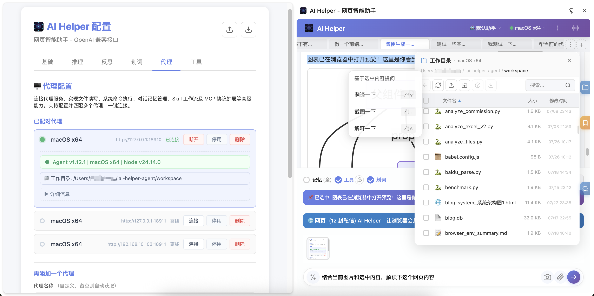

| 项目信息 | 内容 |
|:---:|:---|
| **项目名称** | AI Helper（基于浏览器端的AI办公助手插件） |
| **参赛赛道** | 开源 AI 工具赛道 |
| **项目负责人** | 席维成 |
| **所在单位** | 平安 |
| **开源协议** | MIT License |
| **版本号** | v1.0.0 |

**2026 上海开源软件应用创新大赛**

**作品介绍文档**

</div>

---

## 一、项目背景

### 1.1 痛点分析

在日常工作场景中，用户每天在浏览器上花费大量时间阅读文档、处理数据、填写表单和搜索信息。然而，现有的 AI 工具存在以下核心痛点：

- **AI 与浏览器能力割裂**：主流 AI 对话工具（如 ChatGPT 网页版）是独立应用，无法感知用户当前浏览的页面内容，更无法替用户操作浏览器中的元素。
- **数据搬运成本高**：网页表格、列表数据需要手动复制粘贴到 Excel，耗时且易出错，无法自动化批量处理。
- **表单填写效率低**：面对大量重复性表单（如信息录入、审批提交），用户需要逐页切换、手动填写，缺乏智能辅助。
- **长文档阅读成本高**：阅读长篇技术文档、合同条款时，用户需要人工总结关键信息，缺乏即时智能摘要能力。
- **缺乏质量保障**：传统 AI 工具直接返回 LLM 原始输出，缺少对工具调用结果和最终答案的质量校验机制，可靠性不足。
- **工具扩展性弱**：大多数 AI 工具内置固定功能集，用户无法根据自身需求灵活扩展自定义工具和技能。

### 1.2 项目定位

AI Helper 是一款基于大语言模型（LLM）的 Chrome 浏览器智能助手扩展，采用 ReAct（Reasoning + Acting）推理循环架构。它不只是一个被动问答的聊天工具，而是一个能真正理解网页内容、自主操作浏览器、执行文件系统操作、并具备多级质量保障体系的智能 Agent 平台。

项目核心目标是将浏览器转化为 AI 的操作系统——LLM 通过 40+ 项内建工具和 MCP 动态扩展工具，像人类一样操作网页：点击、填表、拖拽、滚动、截图、提取数据，同时通过本地代理服务获得文件读写、命令执行和 Skill 技能系统能力，实现真正的浏览器端 AI 办公助手。

### 1.3 目标用户

| 用户群体 | 典型场景 | 核心价值 |
|:---:|:---|:---|
| 开发者 | 代码审查、文档阅读、技术调研 | 自动化网页操作，智能代码分析 |
| 知识工作者 | 信息收集、文档处理、内容撰写 | 划词问答，长文摘要，多格式文件解析 |
| 数据分析师 | 数据采集、表格处理、报告生成 | 网页表格提取导出，批量数据处理 |
| 运营人员 | 信息录入、表单填写、内容管理 | 自动填表，批量操作，任务编排 |
| 日常用户 | 网页翻译、信息搜索、内容收藏 | 划词翻译，智能搜索，消息收藏 |

---

## 二、技术架构

### 2.1 五层架构总览

项目采用 Chrome Extension Manifest V3 协议，通过五层架构实现职责分离和模块化解耦。各层之间通过 Chrome Extension API 的消息通道进行通信，确保安全性和隔离性。

**架构概览：**

```
┌─────────────────────────────────────────────────────────────────────┐
│  UI 层 - Side Panel                                                  │
│  对话面板/Markdown渲染 | 多会话管理 | 执行日志/Token统计             │
│  工作目录/文件预览 | 划词工具栏/Agent选择器                          │
├─────────────────────────────────────────────────────────────────────┤
│  核心逻辑层 - Background Service Worker                              │
│  消息路由 | ReAct推理循环 | 三级反思系统 | 工具执行调度              │
│  工具预筛选 | Agent通信 | 流式控制                                   │
├─────────────────────────────────────────────────────────────────────┤
│  页面执行层 - Content Script                                          │
│  页面内容提取 | 页面交互操作 | Shadow DOM穿透 | 划词浮动工具栏       │
├─────────────────────────────────────────────────────────────────────┤
│  代理服务层 - Node.js Agent                                           │
│  文件系统/路径沙箱 | 命令执行/三级安全 | Skill系统                    │
│  MCP协议 | 审计日志/回收站                                            │
├─────────────────────────────────────────────────────────────────────┤
│  数据持久化层 - Storage                                               │
│  IndexedDB(会话/原型/统计/断点) | chrome.storage.local(配置)        │
│  chrome.storage.session(跨重启恢复)                                   │
└─────────────────────────────────────────────────────────────────────┘
```

| 层级 | 模块 | 职责 |
|:---:|:---|:---|
| UI 层 Side Panel | side_panel.html + src/side_panel/ | 对话管理、多会话标签页、Markdown/Mermaid 渲染、工具面板、执行日志、工作目录管理、Agent 选择器、图片标注编辑 |
| 核心逻辑层 Background | src/background/ (Service Worker) | 消息路由、ReAct 推理循环、三级反思系统、工具执行调度、工具预筛选、Agent 通信、流式响应控制、Token 统计 |
| 页面执行层 Content Script | src/content/ (注入到用户页面) | 页面内容提取、可交互元素查询、点击/填表/拖拽等交互操作、Shadow DOM 递归穿透、划词浮动工具栏 |
| 代理服务层 Agent | agent/ (Node.js 独立进程) | 文件系统操作、命令执行（三级安全）、Skill 系统、MCP 协议扩展、路径沙箱、文件回收站、审计日志 |
| 数据持久化层 Storage | src/storage/ + chrome.storage | IndexedDB（会话/原型/统计/断点）、chrome.storage.local（配置）、chrome.storage.session（跨重启恢复） |

### 2.2 核心数据流

用户在 Side Panel 输入消息后，数据流经以下路径完成一次完整的 ReAct 推理循环：

1. **用户输入 -> Side Panel**：选择 Agent、附加图片/文件、选择 Skill/MCP 服务、可选 @网页上下文
2. **Side Panel -> Background**：通过 chrome.runtime.sendMessage 发送 CALL_API 请求
3. **Background 核心处理**：MCP 工具注入 -> 工具预筛选 -> ReAct 推理循环
4. **ReAct 循环**：Token 预算管理 -> 上下文压力监测 -> LLM API 调用（带流式响应）
5. **工具执行**：敏感操作确认 -> Background/Content Script/Agent 分发执行 -> 工具级反思
6. **质量保障**：后置反思 7 维度评分 -> 合格/修订/重试决策
7. **结果返回**：流式输出到 Side Panel -> Markdown/Mermaid 渲染 -> Token 统计更新

### 2.3 ReAct 推理引擎

ReAct（Reasoning + Acting）是项目的核心推理引擎，让 AI 具备自主思考和行动能力。其核心机制包括：

| 机制 | 说明 |
|:---|:---|
| MCP 工具动态注入 | 每次推理前自动从 Agent 拉取最新 MCP 工具列表，注入到工具池 |
| 工具预筛选 | 正式调用主力模型前，用轻量 API 预判所需工具，将 40+ 工具缩减为 5-10 个，大幅节省 Token |
| 推理循环 | LLM 思考 -> 决定调用工具 -> 执行工具 -> 结果反馈 -> 继续推理，直至生成最终答案 |
| Token 预算管理 | 按模型上下文窗口动态计算可用预算（80%），按 Token 数而非消息数智能截断 |
| 上下文压力监测 | 三级监测（safe/warning/critical），自动触发摘要压缩 |
| 并行工具执行 | 同一轮中标记为可并行的工具通过 Promise.all 并发执行 |
| Checkpoint 断点 | 每轮推理后自动保存断点到 IndexedDB，支持中断后一键恢复，7 天 TTL |
| 多级超时控制 | API 超时 5min、工具超时 10min、整体循环超时 30min |
| SW 重启恢复 | Keepalive 端口监测 SW 静默重启，自动恢复后台任务状态 |

### 2.4 三级反思系统

AI Helper 创新性地引入三级反思系统，从工具执行到最终答案全链路保障输出质量：

| 反思级别 | 触发条件 | 评估维度 | 决策 |
|:---:|:---|:---|:---|
| 工具级反思 | 工具返回错误/空结果/结果过大(>50000字符)/连续3次失败 | 结果有用性快速评估 | 反馈 LLM 调整策略 |
| 子任务反思 | 仅标记为 complex 的子任务（可配置） | 完整性和相关性 | 通过/重试 |
| 后置反思 | 每轮推理完成后自动执行 | 完整性/准确性/相关性/工具使用/清晰度/安全性/效率（7维度） | 通过(>=7)/修订(5-7)/重试(<5) |

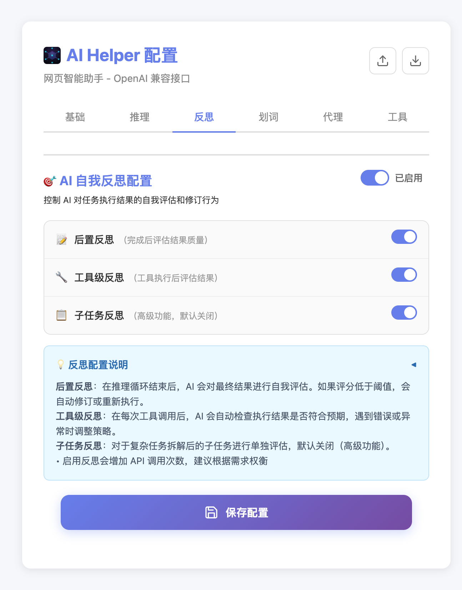

*图 3: 反思系统配置界面*

### 2.5 工具系统（40+ 内建 + MCP 动态扩展）

AI Helper 内建 40+ 项工具，覆盖内容提取、页面交互、表单操作、标签页管理、存储管理、网络请求、媒体输出、调试开发、AI 协作和 Agent 服务等 11 大类别。同时通过 MCP（Model Context Protocol）协议支持动态扩展第三方工具，实现无限能力延伸。

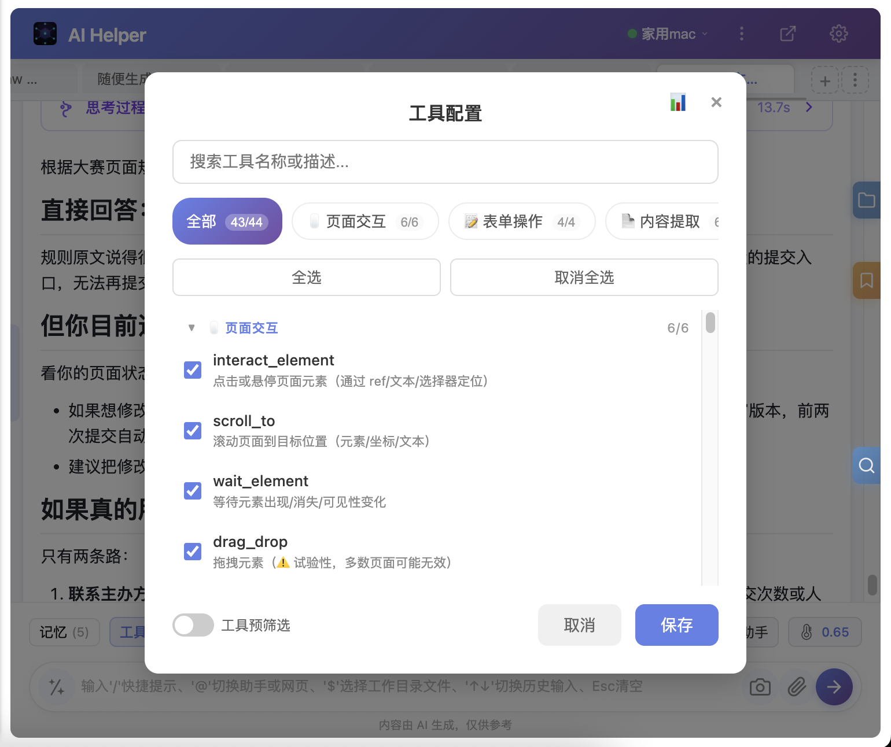

*图 4a: 工具选择面板*

| 工具类别 | 数量 | 代表性工具 |
|:---|:---:|:---|
| 内容提取 | 6 | page_content, extract_data, query_elements, search_in_page, iframe_content, scroll_collect |
| 页面交互 | 5 | interact_element, drag_drop, scroll_to, wait_element, wait_navigation |
| 表单与输入 | 4 | fill_form, keyboard_input, file_upload, select_dropdown |
| 标签页管理 | 2 | manage_tab, list_tabs |
| 书签与历史 | 1 | search_browser_data |
| 存储管理 | 3 | manage_cookies, manage_storage, clear_data |
| 网络请求 | 1 | fetch_url (超时/重试/指数退避) |
| 媒体与输出 | 5 | capture_page, clipboard, qrcode, download_file, notify |
| 调试与开发 | 3 | inject_css, browser_info, highlight_text |
| AI 协作 | 7 | clarify_question, plan_task, preview_ui, search_chats, dispatch_task, manage_agent, exec_log |
| Agent 服务 | 5 | agent_file, agent_trash, agent_exec, agent_search, agent_skill |
| 长期记忆 | 1 | agent_memory (store/recall/manage) |

### 2.6 上下文管理与 Token 优化

长对话场景下，上下文管理是核心挑战。AI Helper 实现了完整的 Token 预算管理和上下文压缩体系：

- **自适应 Token 估算**：中文字符约 1.5 chars/token，英文约 4 chars/token，精准估算不依赖外部 tokenizer
- **上下文窗口自动检测**：根据模型名自动推断上下文窗口大小，支持自定义模型映射
- **消息预算计算**：消息预算 = 上下文窗口 - 系统提示词 - 工具定义 - 输出预留（20%）
- **三级压力监测**：safe（<60%）、warning（60-80%）、critical（>80%），自动触发不同策略
- **上下文增量摘要**：压力达到 critical 时自动对早期工具调用轮次生成 LLM 摘要，替代原始内容
- **引用压缩**：长引用/选中内容自动压缩为摘要，避免永久占据上下文空间
- **Token 级截断**：70% 开头 + 30% 结尾 + 截断标记，保留 tool_calls/tool 消息配对完整性

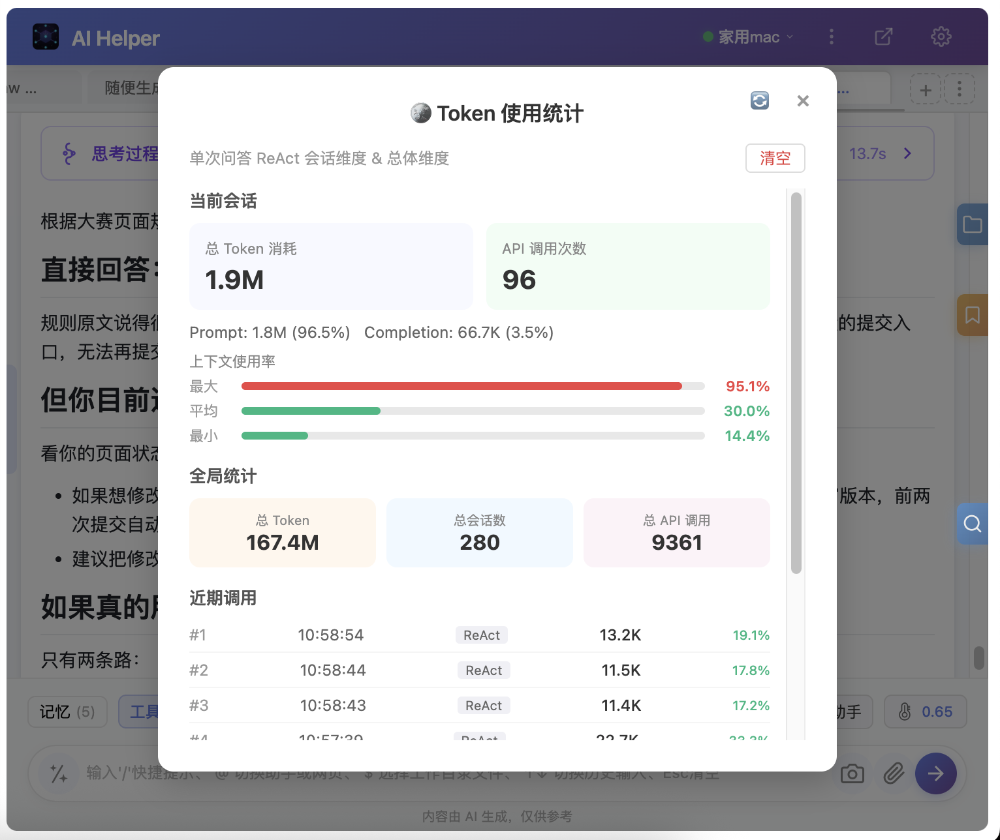

*图 5: Token 统计面板*

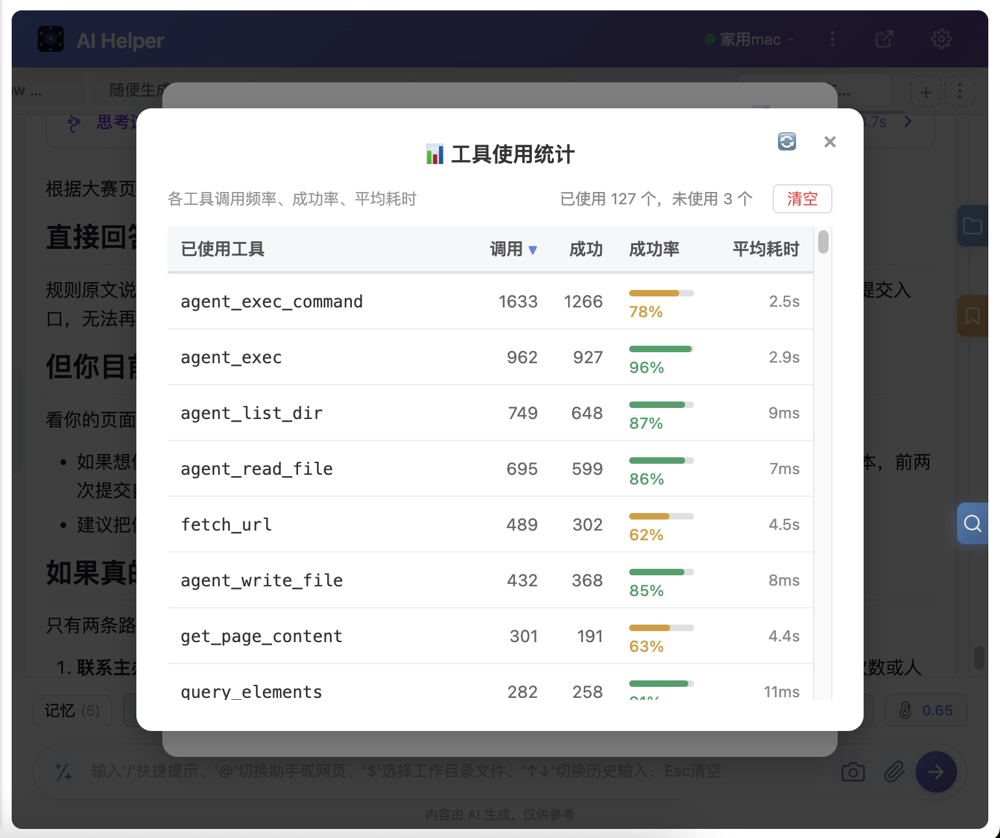

*图 5a: 工具使用统计*

---

## 三、应用场景

### 3.1 智能网页操作

用户只需用自然语言描述需求，AI Helper 即可自动完成网页操作。例如："帮我在这个页面的搜索框输入'AI 助手'并点击搜索按钮"，AI 会通过 query_elements 识别可交互元素，然后用 interact_element 点击和 fill_form 填写表单。

Shadow DOM 深度穿透能力让 AI 能操作现代前端框架（React/Vue/Web Components）渲染的组件，包括 contenteditable 编辑器、prosemirror 富文本编辑器等，这是传统自动化工具难以做到的。

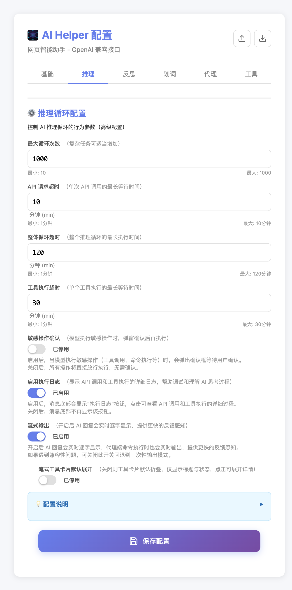

*图 6: ReAct 推理循环配置*

### 3.2 数据采集与处理

用户在浏览包含表格数据的网页时，通过自然语言指令"提取这个页面的表格数据并导出为 Excel"，AI Helper 调用 extract_data 工具提取结构化表格数据，渲染为可导出的 Markdown 表格，支持一键导出为 Excel 文件。同时支持 scroll_collect 滚动收集长页面内容，自动去重聚合。

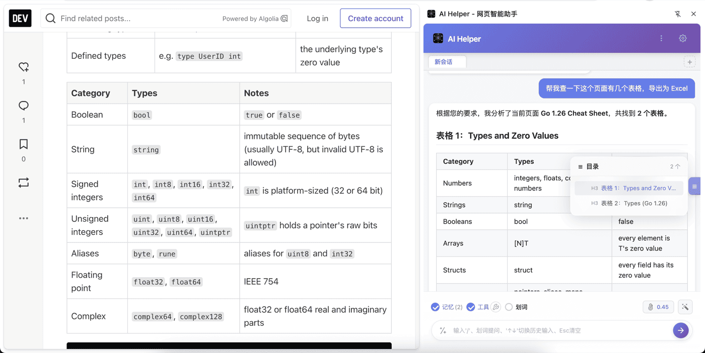

*图 7: 页面表格识别与导出*

### 3.3 划词即用 AI 问答

在任意网页选中文本后，自动弹出毛玻璃风格浮动工具栏，提供 AI 搜索、解释、翻译、总结等快捷操作。支持自定义工具栏按钮和拖拽排序，可按域名屏蔽，结果面板可拖拽缩放。这是浏览器内最自然的人机交互方式——用户无需切换到独立 AI 应用。

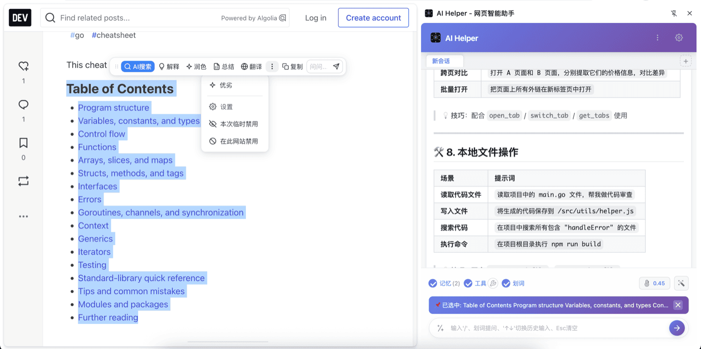

*图 8: 划词浮动工具栏*

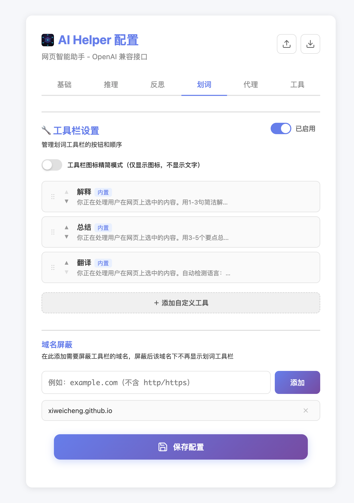

*图 8a: 划词工具栏自定义配置*

### 3.4 多模态文件问答

用户可直接在侧边栏上传 PDF、Word、Excel 等 50+ 种格式文件进行问答。浏览器端原生提取（PDF.js/mammoth.js/SheetJS），无需依赖服务器，保护隐私。连接 Agent 后优先上传至工作目录，支持大模型直接操作原始文件。同时支持图片识别（Vision API）和图片标注编辑器（6 种标注工具 + Undo）。

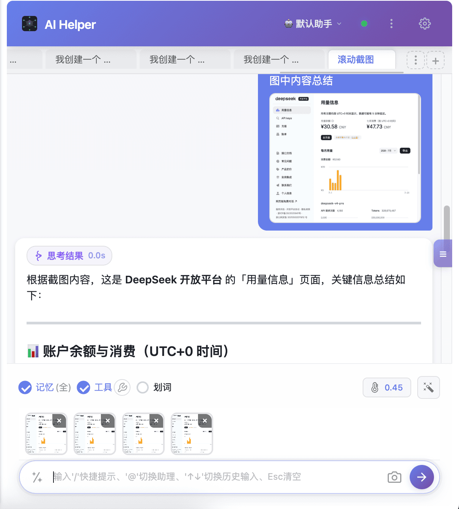

*图 9: 多模态图片识别对话*

### 3.5 多 Agent 协作

内置 5 种专业助手模板（默认助手、代码审查专家、网页自动化助手、数据分析师、文档撰写助手），支持创建自定义 Agent 并配置独立工具权限。通过 dispatch_task 工具，可将复杂任务拆解为子任务，分派给不同 Agent 并行处理，实现真正的多 Agent 协作。

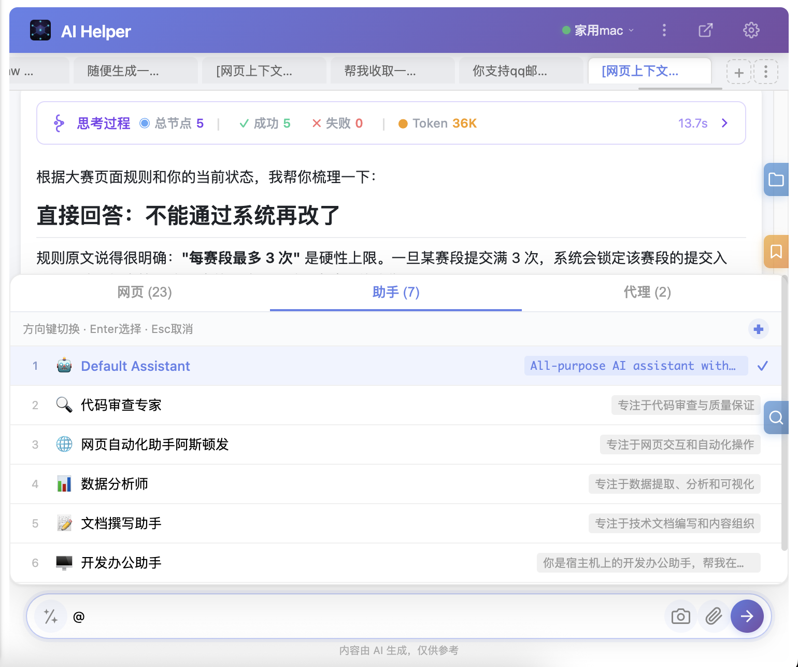

*图 10: 多智能体助手管理*

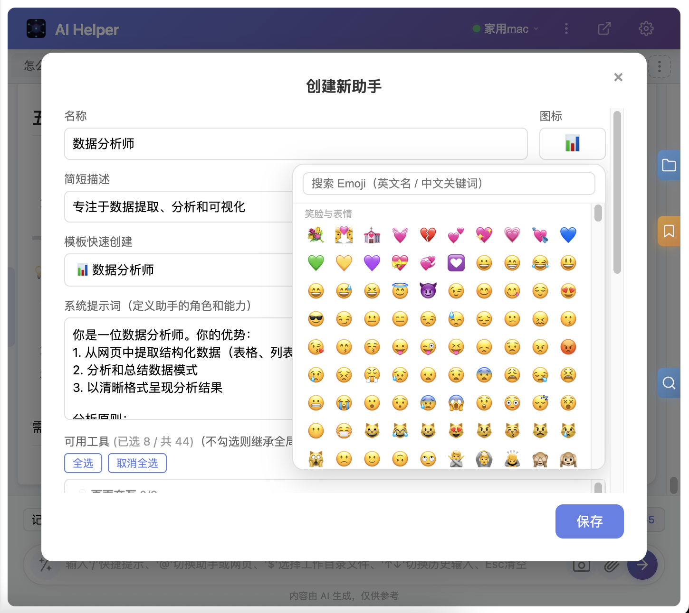

*图 10a: 智能体助手自定义*

### 3.6 本地文件管理与命令执行

连接本地 Agent 服务后，AI Helper 可直接在侧边栏浏览和管理本地文件系统：目录树浏览、多选操作、拖拽移动、键盘导航、流式上传/下载、文件预览（文本/PDF/Word/Excel/图片）。同时支持终端命令执行，采用黑/灰/白名单三级安全机制，敏感操作需确认。

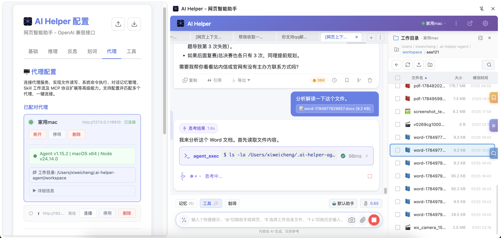

*图 11: Agent 文件管理与命令执行*

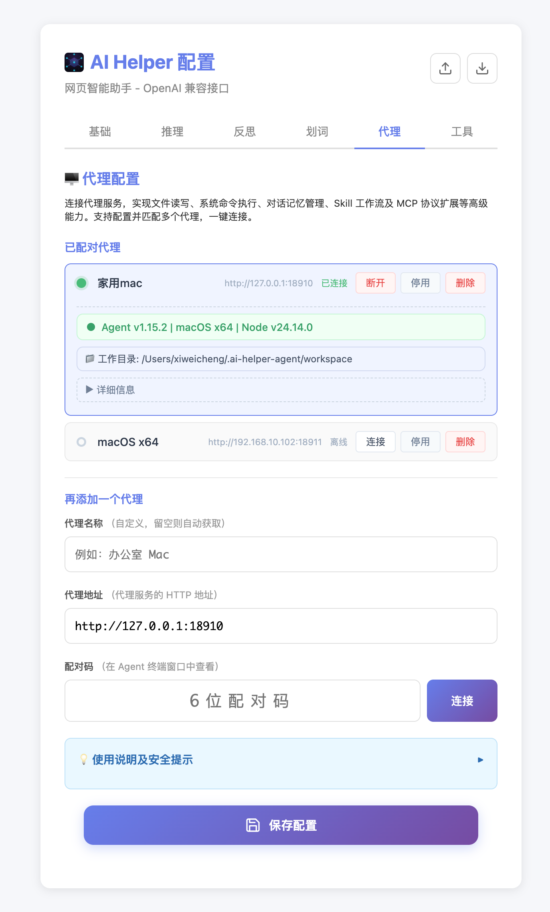

*图 11a: 代理服务配置*

### 3.7 MCP 协议无限扩展

通过 MCP（Model Context Protocol）协议，用户可连接任意第三方工具服务器，工具自动注册到系统中。支持同时连接多个 MCP Server，工具自动合并按 Server 分组，环境变量独立配置。这让 AI Helper 具备了无限的扩展能力——从数据库查询到 API 调用，从代码执行到文件转换。

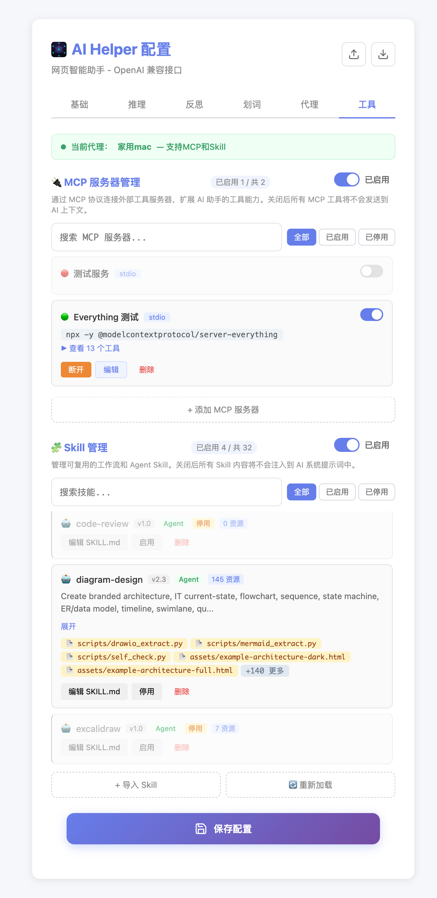

*图 12: MCP 与 Skill 工具箱配置*

### 3.8 灵活配置与个性化

AI Helper 提供丰富的配置选项，让用户根据自身需求个性化定制 AI 助手行为。从 API 基础配置到模型参数微调，从提示词管理到 UI 原型生成，覆盖完整的工作流配置。

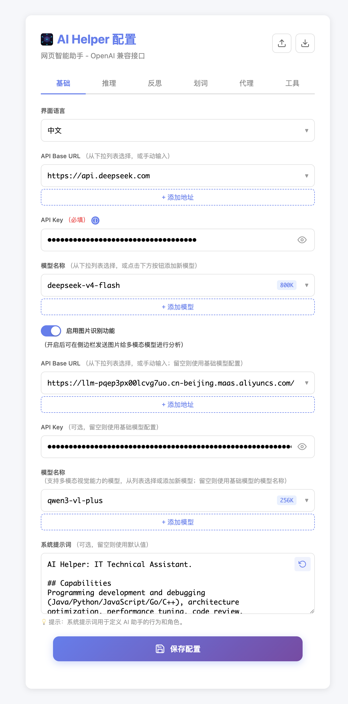

*图 12a: 大模型对接基础配置*

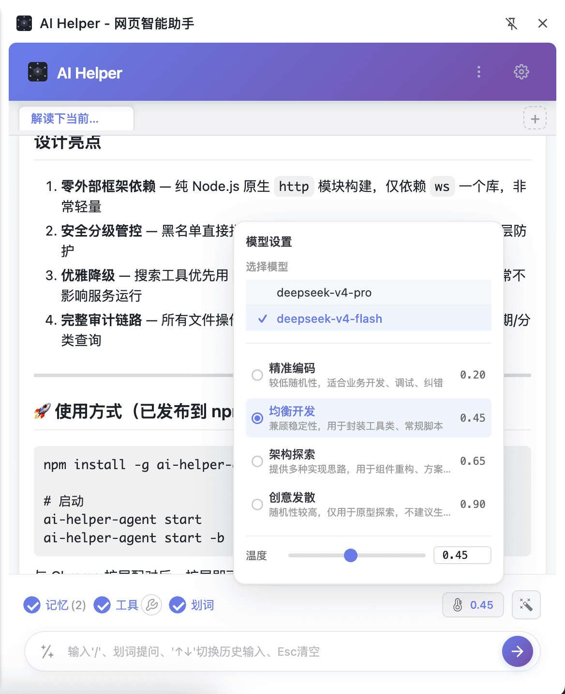

*图 12b: 模型参数便捷调整*

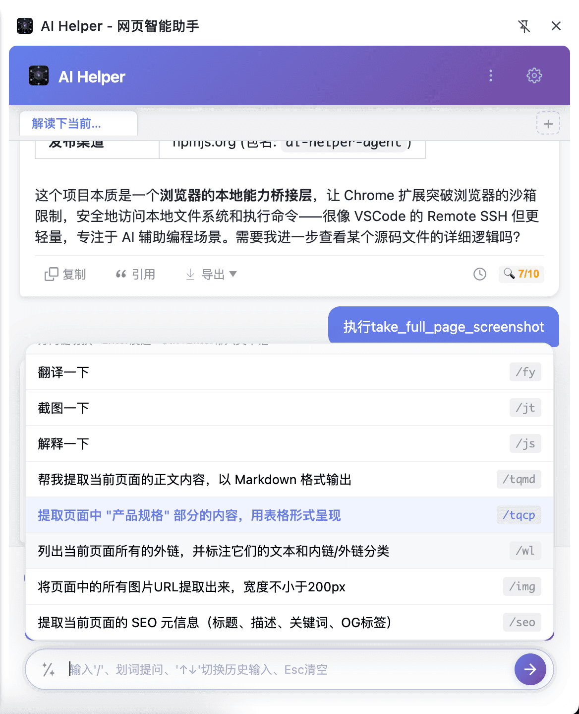

*图 12c: 自定义提示词管理*

### 3.9 UI 原型生成与管理

AI Helper 支持 AI 在对话中直接生成可交互的 HTML 页面原型，并在侧边栏中实时预览。生成的原型保存到 IndexedDB 原型库中，支持缩放预览、下载 HTML 文件、继续优化指令。这为前端开发者和产品经理提供了从想法到原型的快速验证路径。

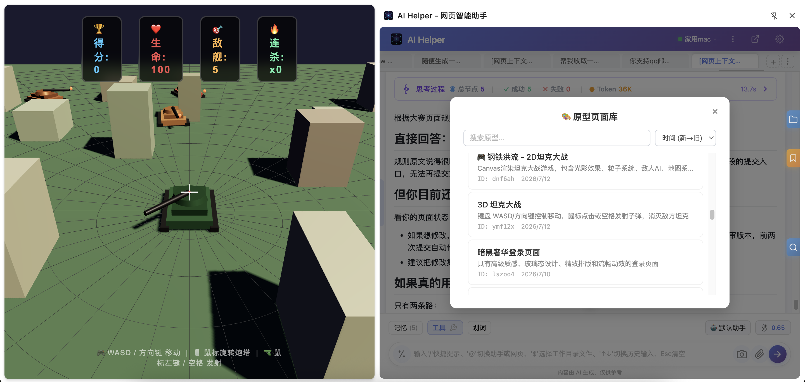

*图 12d: 对话生成 UI 原型页面*

---

## 四、创新点

### 4.1 真正的浏览器操控能力

不同于只能读取网页内容的 AI 工具，AI Helper 让 LLM 像人类一样操作网页——点击、填表、拖拽、滚动、等待元素、上传文件。通过 query_elements 提供 ref/selector 双重定位，通过 Shadow DOM 递归穿透操作现代前端组件，支持 React 受控组件绕过和 contenteditable 富文本编辑。这让 AI 从被动问答进化为主动操控。

### 4.2 三级反思质量保障体系

创新的预筛选 -> 工具级反思 -> 子任务反思 -> 后置反思多级质量保障机制。工具级反思在工具执行后快速评估结果有用性；子任务反思评估复杂子任务完整性；后置反思对最终答案进行 7 维度质量评分（完整性/准确性/相关性/工具使用/清晰度/安全性/效率）。根据评分自动决定通过、修订或重新执行，确保输出质量而非简单返回 LLM 原始结果。

### 4.3 工具预筛选与 Token 成本优化

40+ 个工具定义会消耗大量 Token。AI Helper 在每次调用主力模型前，用一次轻量 API 预判所需工具，将工具缩减为 5-10 个相关项，大幅节省成本。配合 Token 预算管理（按模型上下文窗口动态计算）、上下文压力三级监测（safe/warning/critical）和增量摘要压缩，实现长对话质量不下滑。

### 4.4 多 Agent 协作与任务拆解

支持将复杂任务拆解为子任务（plan_task），支持顺序、并行、条件三种执行策略。通过 dispatch_task 将子任务委派给不同专业 Agent 并行执行，子 Agent 独立运行并返回结果。内置 5 种角色模板，支持自定义 Agent，每个助手拥有独立的系统提示词和工具权限。实现真正的多智能体协作，而非简单的单轮对话。

### 4.5 MCP 协议无限扩展

通过 Model Context Protocol（MCP）协议动态扩展第三方工具能力。支持同时连接多个 MCP Server，工具自动合并按 Server 分组，环境变量独立配置。每次推理前自动同步最新工具列表，实现工具的即插即用。配合 Skill 系统（Workflow + Agent 两种类型），从对话中自动沉淀技能，形成可复用知识库。

### 4.6 断点续接与任务恢复

ReAct Checkpoint 系统在每轮推理后自动保存断点到 IndexedDB，任务中断后可一键恢复继续执行。Service Worker 静默重启后通过 chrome.storage.session 自动恢复后台任务状态。流式输出完整保存到消息历史，刷新页面不丢失。Checkpoint 7 天 TTL 自动过期，避免数据堆积。这让长时间运行的任务具备了工程级的可靠性保障。

### 4.7 浏览器原生多格式文件处理

完全在浏览器端实现 PDF（PDF.js）、Word（mammoth.js）、Excel（SheetJS）和 50+ 种文本格式的文件提取，无需依赖服务器处理，保护用户隐私。支持文件预览（带行号的语法高亮、PDF 翻页、Word HTML 预览、Excel 表格渲染）、批量上传下载、拖拽移动、虚拟滚动优化大目录性能。

### 4.8 双平台架构（Chrome + Electron）

通过平台适配层（platform/adapter.js）将 Chrome API 调用与业务逻辑分离，实现同一套代码同时发布为 Chrome 扩展和 Electron 桌面应用。Chrome 版本保留完整的浏览器操控能力（划词工具栏、页面自动化），Electron 版本保留全部 AI 自主能力（ReAct 循环、工具执行、文件操作），用户可根据使用场景选择最适合的形态。

---

## 五、功能完成度

AI Helper 已完成 v1.0.0 版本的全部核心功能开发，当前功能完成度如下：

| 功能模块 | 完成状态 | 完成度 | 备注 |
|:---|:---:|:---:|:---|
| ReAct 推理循环 | 已完成 | 100% | 含工具预筛选、并行执行、Checkpoint 断点 |
| 三级反思系统 | 已完成 | 100% | 工具级/子任务/后置反思，7 维度评分 |
| 40+ 内建工具 | 已完成 | 100% | 11 大类别，含敏感操作确认 |
| 多 Agent 管理 | 已完成 | 100% | 5 种模板 + 自定义 + 子任务分派 |
| MCP 协议扩展 | 已完成 | 100% | 多 Server + 动态注入 + 环境变量 |
| Skill 系统 | 已完成 | 100% | Workflow + Agent 两种类型 |
| 多模态输入 | 已完成 | 100% | 图片识别 + 文件提取（50+ 格式）+ 标注编辑 |
| 划词浮动工具栏 | 已完成 | 100% | 自定义按钮 + 域名屏蔽 + 追问面板 |
| 上下文管理 | 已完成 | 100% | Token 预算 + 三级压力监测 + 增量摘要 |
| 工作目录管理 | 已完成 | 100% | 目录树 + 上传/下载 + 文件预览 + 回收站 |
| 多会话管理 | 已完成 | 100% | 标签页 + 归档 + 导出/导入 |
| Electron 桌面版 | 已完成 | 90% | 核心功能可用，部分浏览器特性降级 |
| 消息搜索与收藏 | 已完成 | 100% | 全文搜索 + AND/OR 语法 + 书签收藏 |
| 长期记忆系统 | 已完成 | 100% | store/recall/manage + 自动压缩 |
| 审计日志 | 已完成 | 100% | JSON Lines + 30 天保留 + API 查询 |

> **说明**：Electron 桌面版完成度 90%，缺失的 10% 为浏览器特有功能（划词工具栏需要浏览器页面环境、页面自动化需要 Content Script 注入），这些功能在桌面版中自动降级或隐藏，不影响核心 AI 助手能力。

---

## 六、技术栈

| 技术 | 用途 |
|:---|:---|
| Chrome Manifest V3 | 最新 Chrome 扩展协议，Service Worker + Side Panel API |
| Vite + @crxjs/vite-plugin | 构建工具链，ES Module，开发热重载（HMR） |
| Service Worker | 后台进程，API 调用和工具执行调度 |
| Side Panel API (Chrome 114+) | 侧边栏 UI，对话面板主界面 |
| Content Script | 页面注入，DOM 操作和页面交互 |
| Offscreen Document | MV3 剪贴板操作兼容层 |
| IndexedDB | 会话/原型/Token 统计/Checkpoint/收藏 持久化 |
| chrome.storage.local/session | 配置存储 / 跨重启状态恢复 |
| OpenAI Compatible API | LLM 调用（含 Vision），支持流式响应 |
| marked.js | Markdown 渲染引擎 |
| mermaid.js | 图表渲染引擎（流程图/时序图/甘特图） |
| pdfjs-dist | PDF 文件文本提取 |
| mammoth.js | Word .docx 文件文本提取 |
| SheetJS (xlsx) | Excel .xlsx/.xls 文件文本提取 |
| Node.js (Agent) | 本地文件/命令服务、Skill 系统、MCP 协议 |
| WebSocket (Agent) | 命令输出实时流式传输 |
| MCP Protocol | Model Context Protocol，第三方工具动态扩展 |
| Electron | 桌面应用打包，跨平台支持 |

---

## 七、安全设计

### 7.1 敏感工具安全确认

以下工具操作前会弹出确认对话框（30 秒超时自动拒绝，可全局关闭）：manage_tab（close）、download_file、manage_cookies、clear_data、agent_file（delete）、agent_exec。

### 7.2 Agent 命令执行三级安全

| 级别 | 策略 | 示例 |
|:---:|:---:|:---|
| 黑名单 | 始终禁止 | rm -rf /, mkfs.*, fork 炸弹, curl-to-shell 管道等 |
| 灰名单 | 需确认 | sudo, npm install -g, chmod -R 777, git push --force 等 |
| 白名单 | 直接放行 | 常规命令（ls, cat, grep, git status 等） |

### 7.3 其他安全措施

- **路径沙箱**：realpathSync 解析符号链接，前缀匹配白名单路径，防止路径穿越攻击
- **配对认证**：4 位动态码 + extensionId 配对，生成 Bearer Token
- **脚本保护**：写入 .sh/.py/.js 等自动去除执行权限
- **大小限制**：请求体 10MB，单文件 50MB
- **文件回收站**：删除文件默认软删除至 ~/.ai-helper-agent/.trash/，7 天自动清理，支持恢复
- **审计日志**：双通道输出（终端格式化 + 文件 JSON Lines），按日命名，自动清理 30 天
- **环境变量白名单**：仅约 40 个安全环境变量可传递给子进程，TERM=dumb 禁用交互

---

## 八、开源与协作

AI Helper 采用 MIT License 开源协议，代码完全公开。项目结构清晰，模块化设计，代码注释清晰简洁，准确描述设计思路、功能与原理，提升可读性与可维护性。

### 8.1 项目结构

| 模块 | 路径 | 说明 |
|:---:|:---:|:---|
| Chrome 扩展 | src/ | Side Panel UI + Background SW + Content Script + Options Page + Storage |
| 本地代理服务 | agent/ | Node.js 独立进程，文件系统/命令执行/Skill/MCP 协议支持 |
| 第三方库 | libs/ | marked.js, mermaid.js, pdf.js, mammoth.js, SheetJS 等 |
| 构建脚本 | scripts/ | fix-build.js, generate-icons.js, deploy-pages.sh 等 |
| 文档 | docs/ | 项目文档、截图、GitHub Pages |
| 测试 | test/ | Vitest 单元测试 + Playwright E2E 测试 |

### 8.2 构建与部署

```bash
# 开发模式（Vite 热重载）
npm install && npm run dev

# 生产构建
npm run build

# Agent 全局安装
npm install -g ai-helper-agent

# 测试
npm run test:unit    # Vitest 单元测试
npm run test:e2e     # Playwright E2E 测试
```

### 8.3 代码质量

- **ESLint**：使用 @antfu/eslint-config 规范代码风格
- **模块化设计**：每个功能模块独立文件，职责单一，如 chat-manager.js、react-loop.js、tool-executor.js 等
- **双导出 Proxy 模式**：state.js 采用独特的双导出 Proxy 模式，80+ 状态字段无需框架即可共享
- **多连接 IndexedDB**：支持 SW + Side Panel 双连接安全关闭与重建
- **自动化测试**：Vitest 单元测试 + Playwright E2E 测试
- **国际化支持**：_locales/ 目录下多语言资源，支持中英文切换

---

## 九、总结与展望

AI Helper 通过深度集成浏览器能力与 LLM 推理引擎，打造了一个真正能理解网页内容、自主操作浏览器、执行文件系统操作的智能办公助手。项目的核心价值在于：

- **浏览器即操作系统**：40+ 工具让 LLM 在浏览器中拥有完整的操作能力，从内容提取到表单填写，从截图到文件下载
- **质量优先**：三级反思系统确保输出质量，不是简单返回 LLM 原始结果，而是经过多维度评估和自动修订
- **成本可控**：工具预筛选和 Token 预算管理大幅降低 API 成本，长对话质量不下滑
- **无限扩展**：MCP 协议和 Skill 系统让工具能力无限延伸，从数据库到 API 调用，从代码执行到文件转换
- **双平台覆盖**：Chrome 扩展 + Electron 桌面应用，满足不同使用场景
- **开源协作**：MIT License 完全开源，模块化设计便于社区贡献和功能扩展

### 未来展望

- 持续丰富内建工具集，覆盖更多办公自动化场景
- 优化 MCP 协议生态，支持更多第三方工具集成
- 增强多 Agent 协作能力，支持更复杂的任务编排
- 完善 Electron 桌面版功能，提供更完整的桌面级体验
- 建设开源社区，吸引开发者贡献工具和 Skill

---

## 附录：执行日志示例

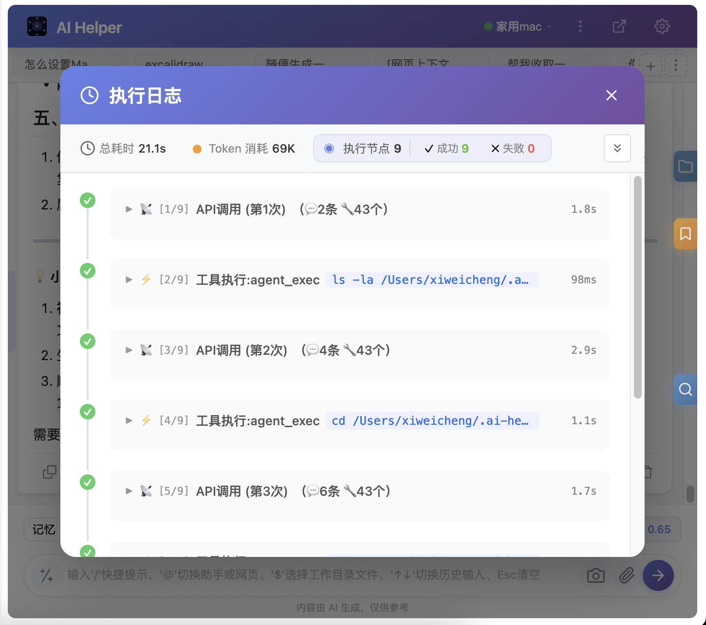

*图 13: ReAct 推理循环执行日志追踪*

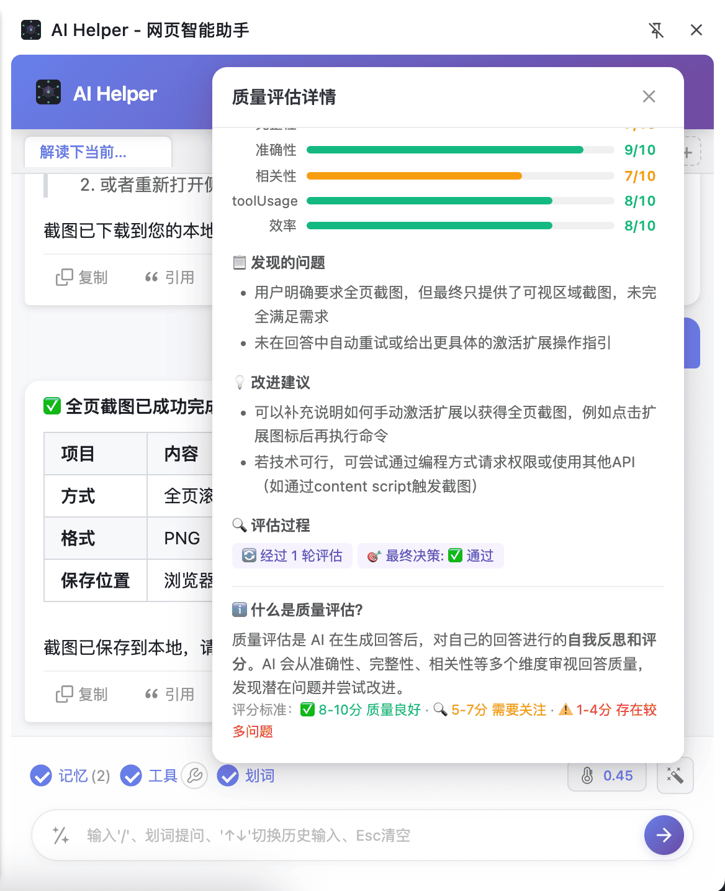

*图 14: 后置反思质量评估展示*
