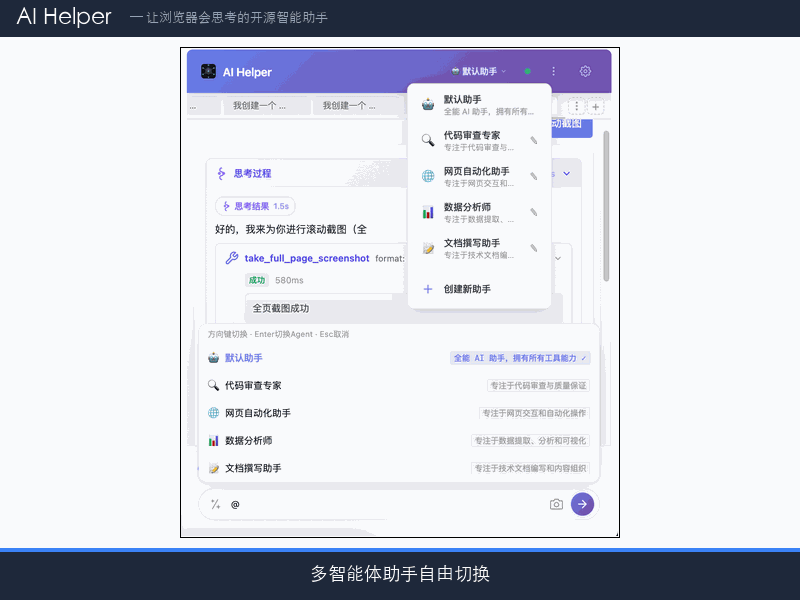

# AI Helper — Web Intelligent Assistant

> An LLM-powered Chrome browser smart assistant extension. Built on a **ReAct (Reasoning + Acting)** inference loop architecture, it supports natural language conversations, browser automation, and web content processing with **50+ built-in tools + MCP dynamic extensions**. Works with an optional local agent service for file system operations, terminal commands, a Skill system, and MCP protocol extensions, plus multimodal file Q&A, image recognition & annotation, long-term memory system, and session import/export capabilities.

## Why AI Helper

AI Helper is a **deeply browser-integrated** smart assistant. Compared to generic chat tools, it has several key differentiators:

- **True Browser Control**: Not just reading page content — it can **click, fill forms, drag, scroll, wait for elements, upload files** — the LLM operates web pages like a human.
- **Three-Tier Quality Assurance**: An innovative **preselection → tool-level reflection → sub-task reflection → post-reflection** multi-tier mechanism ensures output quality rather than raw LLM results.
- **Multi-Agent Collaboration**: Complex tasks can be decomposed and **dispatched to different specialized agents for parallel execution**, enabling true multi-agent teamwork.
- **Tool Preselection**: 50+ tool definitions consume massive tokens. AI Helper runs a **lightweight API pre-check** before each main model call, reducing tools to 5-10 relevant ones for significant cost savings.
- **Token Budget Management**: Dynamically calculates available token budget per model context window, truncates by token count rather than message count, ensuring tool_calls/tool message pairing integrity.
- **Context Compression**: Long quoted content is automatically summarized and compressed, preventing irrelevant information from permanently occupying context space and maintaining conversation quality.

| Feature | Description |
|---------|-------------|
| Platform | Chrome / Edge / Chromium-based browsers |
| Extension Protocol | Manifest V3 |
| Chrome Version | 114+ (requires Side Panel API) |
| API Protocol | OpenAI Chat Completions Compatible (with Vision support) |
| Build Tooling | Vite + @crxjs/vite-plugin |
| Local Agent | Node.js 18+ standalone process providing file/command/MCP/Skill capabilities |
| Multimodal Input | Image recognition (Vision API) + File extraction (PDF/Word/Excel) |
| Skill System | Workflow + Agent skill types, supports creating skills from conversations |
| MCP Protocol | Model Context Protocol, dynamic tool registration & multi-server management |
| Multi-Agent | Custom agents, 4 built-in role templates, sub-task dispatch support |

## Feature Preview



---

## Architecture Overview

The project uses a **five-layer architecture**, communicating via Chrome Extension API messaging channels:

```
┌──────────────────────────────────────────────────────────────┐
│                   Side Panel (UI Layer)                       │
│  side_panel.html + src/side_panel/*.js                        │
│  Chat Management | Multi-session Tabs | Markdown/Mermaid      │
│  Prompt Management | Selection Query | Input History          │
│  Execution Logs | Clarification/Confirmation Dialogs          │
│  UI Prototype Preview | Quality Assessment | Message TOC      │
│  Multi-Agent Manager | Token Stats | Agent Selector           │
│  Image Recognition Input | Image Annotation | File Upload     │
│  Session Export/Import | Skill Selector | MCP Service Selector│
└──────────────┬──────────────────────────────┬────────────────┘
               │  chrome.runtime.sendMessage   │
               ▼                               ▼
┌──────────────────────────┐    ┌──────────────────────────────┐
│  Background Service       │    │    Options Page (Config)      │
│  Worker (Core Logic)      │    │  options.html + src/options/  │
│                          │    │  API Key/Model/Tools/ReAct    │
│  src/background/          │    │  Reflection/Chat/Toolbar      │
│  ├── index.js (router)    │    │  Agent Pairing Management     │
│  ├── react-loop.js (ReAct)│    │  Toolbox (MCP + Skill Mgmt)  │
│  ├── tool-executor.js     │    └──────────────────────────────┘
│  ├── tool-preselector.js  │
│  ├── local-agent-client.js│    ┌──────────────────────────────┐
│  ├── config.js            │    │    Agent Service (Optional)    │
│  ├── state.js             │    │  agent/ (Node.js Process)     │
│  ├── agent-dispatcher.js  │    │  HTTP REST + WebSocket        │
│  ├── stream-controller.js │    │  File Read/Write | Cmd Exec   │
│  ├── token-recorder.js    │    │  Search | Skill System        │
│  └── constants.js         │    │  MCP Protocol Extensions      │
└──────────────┬─────────────┘    │  Path Sandbox | Security     │
               │                   │  File Upload API             │
               │  chrome.tabs.sendMessage                      │
               ▼                   └──────────────────────────────┘
┌──────────────────────────────────────────────────────────────┐
│           Content Script (Page Tool Execution)                │
│  src/content/*.js (injected into web pages)                   │
│  ├── index.js (message routing, page tools)                   │
│  ├── page-tools.js (content extraction, a11y tree, Markdown)  │
│  ├── interaction-tools.js (interaction, TTS, eyedropper)      │
│  ├── advanced-tools.js (video, perf audit, Shadow DOM, screenshot)│
│  └── selection-toolbar.js (selection floating toolbar)        │
└──────────────────────────────────────────────────────────────┘
               │
               ▼
┌──────────────────────────────────────────────────────────────┐
│           Offscreen Document (Auxiliary Layer)                 │
│  src/offscreen/ (Clipboard Operations)                        │
│  │   ├── offscreen.html + offscreen.js (clipboard MV3-compatible implementation)      │
└──────────────────────────────────────────────────────────────┘

┌──────────────────────────────────────────────────────────────┐
│                   Storage (Persistence)                       │
│  src/storage/                                                 │
│  ├── db.js (IndexedDB wrapper, transaction retry, auto-migration)│
│  ├── session-store.js (Session Storage Adapter)               │
│  └── token-store.js (Token Stats Storage)                     │
└──────────────────────────────────────────────────────────────┘
```

### Core Data Flow

```
User Input → Side Panel (Agent Selection, optional image/file, optional Skill/MCP)
  → chrome.runtime.sendMessage('CALL_API')
    → Background: MCP Tool Injection → Tool Preselection → ReAct Loop
      → Token Budget Management → Context Pressure Monitoring → Token Stats
      → LLM API Call (OpenAI Compatible, retry & exponential backoff, streaming)
        → If tool needed: Confirmation Check (sensitive ops) → Execute Tool
          ├── Background (Tab management, bookmarks, etc.)
          ├── Content Script (Page interaction, content extraction, etc.)
          ├── Local Agent (File R/W, command exec, MCP tools, etc.)
          └── Offscreen Document (Clipboard R/W)
        → Tool Reflection → Result Cache → Feed back to LLM
      → Task Decomposition & Parallel Execution (plan_task, sub-agent dispatch)
      → Post Reflection: Multi-dimensional Quality Assessment → Pass/Revise/Retry
    → chrome.runtime.sendMessage('API_COMPLETE')
  → Side Panel: Markdown, Mermaid, Quality Display, Token Stats Update
```

---

## Project Structure

```
ai-helper/
├── agent/                               # Agent Service (Node.js Standalone)
│   ├── bin/agent.js                     # CLI startup script
│   ├── src/
│   │   ├── server.js                    # HTTP + WebSocket server
│   │   ├── executor.js                  # Command execution engine (stream/block)
│   │   ├── security.js                  # Path sandbox + command security tiers
│   │   ├── config.js                    # Agent config (disk persistence)
│   │   ├── auth.js                      # Pairing auth (4-digit dynamic code)
│   │   ├── search.js                    # File/content search (fd/rg acceleration)
│   │   ├── logger.js                    # Structured logging
│   │   ├── skill/                       # Skill System
│   │   │   ├── loader.js               # Skill loader (JSON/YAML/SKILL.md)
│   │   │   ├── registry.js             # Skill registry
│   │   │   ├── executor.js             # Workflow Skill executor
│   │   │   ├── markdown-loader.js      # Agent Skill loader (SKILL.md)
│   │   │   └── template.js             # Skill templates
│   │   └── mcp/                         # MCP Protocol Support
│   │       ├── client.js               # MCP Client (JSON-RPC 2.0)
│   │       ├── registry.js             # MCP Server registry
│   │       ├── transport.js            # Stdio transport
│   │       └── mcp-config.js           # MCP configuration
│   └── package.json
├── icons/                               # Extension icons
│   ├── icon16.png / icon48.png / icon128.png
│   └── README.md
├── libs/                                # Third-party deps (CDN/local)
│   ├── marked.min.js                    # Markdown rendering engine
│   ├── mermaid.min.js                   # Mermaid diagram engine
│   ├── qrcode.min.js                    # QR code generation
│   ├── pdf.worker.min.js               # PDF.js Worker (PDF extraction)
│   └── github-markdown-light.min.css    # GitHub-style Markdown CSS
├── scripts/                             # Build tool scripts
│   ├── fix-build.js                     # Fix @crxjs/vite-plugin build artifacts
│   ├── silent-build.js                  # Silent build (CI-friendly, only outputs on failure)
│   ├── generate-icons.js                # Icon generation script
│   └── deploy-pages.sh                  # Pages deployment script
├── styles/
│   └── styles.css                       # Content Script floating box styles
├── src/                                 # Extension source code
│   ├── background/                      # Background Service Worker
│   │   ├── index.js                     # Entry: message routing, session mgmt, agent health
│   │   ├── react-loop.js               # ReAct inference loop (core, 3-tier reflection)
│   │   ├── tool-executor.js            # Tool registration, execution dispatch, MCP injection
│   │   ├── tool-preselector.js         # Tool preselection (lightweight API pre-filter)
│   │   ├── local-agent-client.js       # Agent HTTP/WebSocket communication
│   │   ├── agent-dispatcher.js         # Sub-task dispatch for agents
│   │   ├── stream-controller.js        # Stream response controller
│   │   ├── token-recorder.js           # Token usage stats recorder
│   │   ├── config.js                    # Config R/W
│   │   ├── constants.js                # Defaults, 50+ built-in tools, category mapping
│   │   ├── state.js                    # Multi-session cancel control, API counter
│   │   └── tools/                       # Tool definitions by category
│   │       ├── browser-tools.js        │ Page interaction + Form + Content (17)
│   │       ├── tab-tools.js            │ Tab mgmt + Bookmarks/History (8)
│   │       ├── storage-tools.js        │ Storage mgmt + Network (4)
│   │       ├── media-tools.js          │ Media output + Debug/Dev (7)
│   │       ├── ai-tools.js             │ AI Collaboration (6)
│   │       ├── agent-tools.js          │ Local Agent (9)
│   │       └── memory-tools.js         │ Long-term Memory (3)
│   ├── content/                         │ Page-injected scripts
│   │   ├── index.js                     # Entry: message routing dispatch
│   │   ├── page-tools.js               # Page content tools (extraction, search, a11y tree)
│   │   ├── interaction-tools.js        # Interaction tools (click, fill, TTS, etc.)
│   │   ├── advanced-tools.js           # Advanced tools (video, perf, Shadow DOM, etc.)
│   │   └── selection-toolbar.js        # Selection floating toolbar
│   ├── offscreen/                       # Offscreen Document (clipboard ops)
│   │   ├── offscreen.html              # Offscreen page
│   │   └── offscreen.js                # Clipboard API bridge
│   ├── side_panel/                      # Side Panel UI
│   │   ├── index.js                     # Entry: event binding, config, keyboard shortcuts
│   │   ├── chat-manager.js             # Chat management (send/receive, logs, export/import)
│   │   ├── markdown-render.js          # Markdown/Mermaid rendering & interaction
│   │   ├── tool-panel.js               # Tool selection popup (category filter, search)
│   │   ├── prompt-manager.js           # Prompt management (CRUD, quick select, drag sort)
│   │   ├── agent-manager.js            # Multi-agent management UI
│   │   ├── agent-store.js              # Agent data persistence
│   │   ├── agent-at-selector.js        # Agent @ selector
│   │   ├── token-stats-panel.js        # Token statistics panel
│   │   ├── session-manager.js          # Multi-session storage API
│   │   ├── session-manager-ui.js       # Session tabs UI (switch, rename, archive)
│   │   ├── clarify-dialog.js           # Clarification dialog (countdown, audio alert)
│   │   ├── confirm-dialog.js           # Sensitive operation confirmation dialog
│   │   ├── ui-prototype.js             # UI prototype preview & management
│   │   ├── message-toc.js              # Message table of contents (auto-nav)
│   │   ├── input-history.js            # Input history (arrow key recall)
│   │   ├── image-preview.js            # Image preview, compression, multi-switch, annotation
│   │   ├── file-extract.js             # File extraction (PDF/Word/Excel/Text), Agent upload
│   │   ├── skill-selector.js           # Skill/MCP service quick selector
│   │   ├── export-import.js            # Session export/import (batch select, format validate)
│   │   ├── execution-log-render.js     # Execution log rendering (task groups, real-time)
│   │   ├── icons.js                     # Shared SVG icon constants
│   │   ├── state.js                     # Global state management (Proxy dual-export)
│   │   ├── utils.js                     # Utilities (Toast, system prompt builder, etc.)
│   │   └── constants.js                # Temperature presets, tool category names
│   ├── options/                         # Extension options page
│   │   ├── index.js                     # Entry: tab switching, form events, agent pairing
│   │   ├── config-manager.js           # Config R/W management
│   │   ├── config-io.js                # Config import/export
│   │   ├── toolbar-config.js           # Toolbar config (drag sort, domain blocklist)
│   │   ├── toolbox-config.js           # Toolbox config (MCP servers + Skill management)
│   │   └── constants.js                # Default system prompts and config constants
│   ├── storage/                         # IndexedDB persistence layer
│   │   ├── db.js                        # IndexedDB wrapper (transaction retry, auto-migration)
│   │   ├── session-store.js            # Session storage adapter
│   │   └── token-store.js              # Token stats storage
│   ├── config/
│   │   └── constants.js                # Storage keys, message types, etc.
│   └── shared/                          # Shared modules
│       ├── tools.js                     # Tool categories, temperature presets
│       ├── utils.js                     # Shared utility functions
│       ├── token-counter.js            # Token counting, budget mgmt, context compression, summaries
│       └── agent-defaults.js           # Built-in agent definitions and templates
├── manifest.json                        # Chrome extension config
├── side_panel.html                      # Side panel HTML
├── options.html                         # Options page HTML
├── vite.config.js                       # Vite build config
├── package.json
└── README.md
```

---

## Core Features

### 1. Multimodal Input

#### Image Recognition Input
Attach images in conversations for multimodal understanding via Vision API (OpenAI-compatible):

- **Image Compression**: Auto-compresses large images (1024px + JPEG 65%), reducing token consumption
- **Independent API Config**: Optional separate API Base / API Key / Model for Vision
- **Global Toggle**: Enable/disable image input at any time
- **Multi-Image Upload**: Attach multiple images for comparative analysis

#### File Upload Q&A
Upload and extract file content directly in the browser — no Agent service required:

- **Supported Formats**:

| Format | Extraction Engine | Notes |
|--------|-------------------|-------|
| PDF | PDF.js (pdfjs-dist) | Full text extraction, multi-page |
| Word (.docx) | mammoth.js | Rich text → plain text |
| Excel (.xlsx/.xls) | SheetJS (xlsx) | Multi-sheet CSV export |
| Plain Text | FileReader API | 50+ extensions auto-detected |

- **Agent-Preferred Upload**: When connected to Agent, automatically uploads to working directory for direct file manipulation
- **Browser Fallback**: When Agent is unavailable, switches to browser-side extraction
- **File Preview Bar**: Shows filename, size, extraction status, supports deletion

#### Image Annotation Editor
A complete in-browser image annotation toolkit, edit images directly in preview before sending:

- **6 Annotation Tools**: Brush (B), Rectangle (R), Ellipse (E), Arrow (A), Line (L), Eraser
- **Adjustable**: Color, thickness, opacity
- **Undo Support** (up to 20 steps, Ctrl+Z)
- **Keyboard Shortcuts**: Enter to confirm, Esc to cancel
- **Auto-update**: Annotation results immediately synced to attachment list

### 2. Multi-Agent Management

Create and manage multiple custom AI agents, each with independent system prompts and tool permissions:

- **Built-in Templates**: Default Assistant, Code Review Expert, Web Automation Assistant, Data Analyst, Documentation Writer
- **Custom Agents**: Create specialized agents with custom icons, names, system prompts, models, temperatures, and tool permissions
- **Agent Selector**: Quick switching at the top of the side panel, with `@AgentName` quick-switch syntax
- **Tool Filtering**: Each agent can have its own toolset to avoid context bloat
- **Sub-task Dispatch**: `dispatch_sub_agent` supports parallel dispatch, sub-agents execute independently and return results
- **Agent Persistence**: Based on `chrome.storage.local`, persists across restarts

### 3. ReAct Inference Loop

The project uses the ReAct (Reasoning + Acting) pattern as its core inference engine:

1. **MCP Tool Dynamic Injection**: Before each inference cycle, automatically pulls the latest MCP tool list from Agent and injects it into RAW_TOOLS
2. **Tool Preselection**: Before the main model call, a lightweight API pre-check determines which tools are needed, reducing 50+ tools to 5-10 relevant ones, significantly cutting token usage
3. **Inference Loop**: LLM thinks → decides to call tools → executes tools → results fed back → continues reasoning
4. **Token Budget Management**: Dynamically calculates available token budget per model context window (80%), truncates by token count, retains tool_calls/tool message pairing integrity
5. **Context Pressure Monitoring**: Three-level monitoring (safe/warning/critical), auto-triggers summary compression
6. **Context Smart Compression**: Long quoted content is automatically summarized and compressed, preventing permanent context occupation
7. **Tool Result Cache**: Parallel tool results are auto-cached (30 entry limit)
8. **Parallel Tool Execution**: Tools marked as parallel in the same round are executed concurrently via `Promise.all`
9. **Task Decomposition**: `plan_task` supports sequential, parallel, and conditional execution strategies with retry/rollback/continue on failure
10. **Sub-task Dispatch**: `dispatch_sub_agent` delegates subtasks to other agents for parallel execution
11. **Streaming Response**: OpenAI streaming support with configurable inter-character delay (simulated typing effect)
12. **Clarification Mechanism**: When info is incomplete, a clarification dialog pops up with auto-paused loop timer and suggested options
13. **Multi-Level Timeout Control**: API timeout 5min, tool timeout 10min, overall loop timeout 30min
14. **Cancel Control**: Users can cancel the inference loop at any time, isolated per session
15. **SW Restart Recovery**: Keepalive ports monitor Service Worker silent restarts, auto-notifying Side Panel to recover. Background task state persisted to `chrome.storage.session`

### 4. Reflection System (Multi-Tier Quality Assurance)

| Level | Description | Trigger Condition |
|-------|-------------|-------------------|
| **Tool-Level** | Quick assessment of tool result usefulness post-execution | Tool returns error / empty result / oversized result (>50000 chars) / 3 consecutive failures |
| **Sub-task Reflection** | Evaluates sub-task result completeness and relevance | Only complex-marked sub-tasks (configurable) |
| **Post-Reflection** | Final answer 7-dimension quality scoring | Auto-executes after each inference cycle |

Post-reflection scoring dimensions: Completeness, Accuracy, Relevance, Tool Usage, Clarity, Safety, Efficiency. Based on score threshold, decides to: pass (≥7), revise (5-7), or re-execute (<5).

### 5. Context Compression & Token Budget Management

Smart context management strategy introduced since v1.0:

- **Adaptive Token Estimation**: Chinese ~1.5 chars/token, English ~4 chars/token
- **Auto Context Window Detection**: Infers context window from model name (supports custom mappings)
- **Message Budget = Context Window - System Prompt - Tool Definitions - Output Reserve**
- **Three-Level Context Pressure**: safe / warning / critical
- **Message Summaries**: When pressure reaches critical, early messages are auto-summarized
- **Quote Compression**: Long quoted/selected content auto-compressed to summaries
- **Token-Level Truncation**: 70% beginning + 30% end + truncation marker
- **Streaming Output Config**: Configurable inter-character render delay (0=instant)

### 6. Token Statistics Panel

- **Real-time Stats**: Token consumption updated after each API call
- **Session Stats**: Current session cumulative, average per round
- **Daily Stats**: Today's cumulative, call count
- **History**: Last 7 days of token usage

### 7. Skill System

Two skill types covering deterministic automation and AI autonomous invocation:

- **Workflow Skill**: JSON/YAML-defined deterministic workflows with parameter validation and result display
- **Agent Skill**: SKILL.md-based AI capability extensions, AI autonomously invokes in conversations
- **Built-in Skill**: `skill-creator` meta-skill for creating new skills from conversations
- **Quick Selector**: "Skills" tab in the input dropdown for quick search and selection
- **Import Methods**: JSON file upload, direct Markdown writing, Zip packages (with resources), URL download
- **Skill Editor**: Visual SKILL.md editing with description, version, and resource management
- **Global Toggle**: One-click enable/disable all Skills in the options Toolbox

### 8. MCP Protocol Extension

Model Context Protocol (MCP) support for dynamically extending third-party tool capabilities:

- **MCP Tool Dynamic Injection**: Before each inference cycle, auto-pulls latest MCP tools from Agent and injects them
- **MCP Client**: JSON-RPC 2.0 communication with stdio transport
- **MCP Server Management**: Visual configuration, connection, disconnection in options "Toolbox" tab
- **Environment Variables**: Per-server independent env vars, sensitive values with password input
- **Multi-Server Support**: Connect multiple MCP Servers simultaneously, tools auto-merged and grouped by server
- **Global Toggle**: One-click enable/disable all MCP services
- **Quick Selector**: "MCP" tab in the input dropdown for quick MCP service selection

### 9. Multi-Session Management

- **Tab Switching**: Horizontal tab bar, auto-restores message history, model, tools, and temperature
- **Session Creation**: One-click creation, auto-generated title (from first user message)
- **Session Rename/Delete**: Right-click context menu
- **Session Archive/Restore**: Up to 20 archived, restorable anytime
- **Cross-Session Message Delivery**: Background task results auto-appended to original session
- **Persistent Storage**: Based on IndexedDB, auto-migrates from legacy `chrome.storage.local`
- **Session Export/Import**: Batch select export as `.aihelper.json`, compatible with new/legacy format import

### 10. Session Export/Import

- **Batch Export**: Dialog with multi-select, select all/deselect/current only
- **Export Format**: `.aihelper.json`, includes full message history, execution logs, reflection scores, HTML content, agent config
- **Import Compatibility**: Supports new `.aihelper.json` format and legacy message array format
- **Smart Filenames**: Single session named by session title, multi-session named by count + timestamp

### 11. Side Panel Chat

- **Natural Language Conversation**: OpenAI-compatible API, default DeepSeek V4 Pro
- **Model Switching**: Built-in DeepSeek models, custom model add/remove with context window mapping
- **Temperature Control**: 4 presets (Precision 0.2 / Daily 0.45 / Divergent 0.65 / Creative 0.9) with continuous fine-tuning
- **Memory Limit**: Configurable history message count sent to LLM
- **Isolated Chat**: Standalone Q&A mode without historical context
- **Selection Query**: Select text in side panel to show quick action menu
- **Prompt System**: Custom prompts CRUD, `/` quick select, drag-to-reorder
- **Input History**: Arrow key recall, auto-dedup management
- **System Prompt**: Auto-injects environment info (Chrome extension, OS, agent platform), enforces task planning rules

### 12. Markdown & Mermaid Rendering

- Full Markdown support: code blocks (with line numbers, copy button, language tag), tables (export Excel/copy Markdown), quotes, lists
- **Three-Phase Placeholder Strategy**: Mermaid → Code blocks → Tables extracted as placeholders sequentially, restored after rendering
- Mermaid diagrams: flowcharts, sequence diagrams, Gantt charts, etc. Zoom (Ctrl+scroll), drag-pan, download PNG, copy to clipboard, view source
- **Table Cell Inline Markdown**: Supports bold, italic, code, strikethrough

### 13. UI Prototype Preview System

- **Inline Preview**: iframe `srcdoc` rendering, auto-detects complete docs vs fragments
- **Zoom Control**: 0.25x-2.0x, Ctrl+scroll / Ctrl+0 to reset
- **Prototype Library**: Save to IndexedDB, supports open/edit/delete
- **Export**: Download as .html or open in new tab
- **Continue Optimization**: One-click fills optimization instructions into input

### 14. Message Operations

| Operation | Description |
|-----------|-------------|
| Copy Message | Copy raw Markdown content |
| Edit & Resend | Refill message into input box |
| Quote Follow-up | Set assistant message as quoted context (auto-compressed) |
| Export Word | Markdown → styled .doc download |
| Export PDF | Browser print window export |
| Export JSON | Full conversation history (with execution logs) JSON download |

### 15. Selection Floating Toolbar

Auto-appears with frosted-glass style when text is selected on any webpage:

- **AI Search**: Opens side panel and initiates search
- **Quick Actions**: Explain, Translate, Summarize
- **Custom Tools**: Add custom prompt tools with drag-to-reorder
- **Follow-up Input**: Inline input box for direct follow-up
- **Result Panel**: Draggable, resizable floating panel with Markdown rendering and lock feature
- **Suggested Follow-ups**: Auto-generated follow-up buttons in AI responses
- **Configuration**: Icon-only mode, visible count, domain blocklist, temporary hide

### 16. Execution Log Panel

- **Real-time Mode**: Live updates during inference with pulse animation
- **Static Mode**: Complete execution timeline displayed on completion
- **Task Group Visualization**: Complex tasks grouped by task groups, with collapse/expand
- **Node Details**: Tool name, status, duration, input params, output content, API request details
- **Summary Stats**: Total nodes, success/failure count, sub-task progress
- **Status Filtering**: Filter by success/failure/sub-task
- **Single Expand**: Click title to expand/collapse individual details

### 17. Quality Assessment Display

Post-reflection result visualization:

- **Overall Score**: 0-10, color-coded (green/yellow/red) + emoji
- **7-Dimension Radar**: Per-dimension progress bar
- **Issue Discovery**: Specific issues and improvement suggestions
- **Evaluation Process**: Round count, decision, reasoning details

### 18. Message Table of Contents (TOC)

Hover over assistant messages to auto-generate floating navigation:

- Auto-extracts H1-H6 headings
- Floating panel, smooth scroll to target
- 1.5s highlight flash effect

### 19. Long-term Memory System

AI Helper has long-term memory capabilities, storing and retrieving user information across sessions:

- **Memory Storage**: AI automatically identifies important information (preferences, knowledge, decisions) and calls `agent_memory_store` to store it
- **Memory Types**: Supports fact memory and conversation summary memory
- **Smart Retrieval**: Use `agent_memory_recall` to search historical memories by keywords, tags, and type
- **Memory Management**: Auto-review memory quality, merge duplicates, evict low-value memories
- **Tag Classification**: Preference, knowledge, decision, and custom tag categories
- **Importance Scoring**: 1-10 scale for priority sorting
- **Auto-Archival**: Facts capped at 50, summaries at 20, exceeding triggers auto-compaction

---

## Built-in Tools (50+ Configurable + MCP Dynamic Extensions)

### Content Extraction (7)
| Tool | Description |
|------|-------------|
| `get_page_content` | Get page content in multiple formats (text/html/markdown/json) |
| `extract_data` | Extract structured data (table/links/forms/images/metadata) |
| `query_interactive_elements` | Extract interactive elements (recommended for token savings, supports countOnly) |
| `search_in_page` | Regex search page text (with highlight support) |
| `find_similar_elements` | Find similar structure elements |
| `get_iframe_content` | Get iframe content (same-origin, nested support) |
| `scroll_and_collect` | Scroll and collect long content (dedup aggregation) |

### Page Interaction (6)
| Tool | Description |
|------|-------------|
| `click_element` | Click element (CSS selector, auto-clean quotes) |
| `hover_element` | Mouse hover |
| `drag_and_drop` | Drag-and-drop operation |
| `scroll_to` | Scroll to position/element (with alignment options) |
| `wait_for_element` | Wait for element appear/disappear (strict visibility check) |
| `wait_for_navigation` | Wait for page navigation (load/domcontentloaded/networkidle) |

### Form & Input (4)
| Tool | Description |
|------|-------------|
| `fill_form` | Batch form filling (supports rich text editor/contenteditable) |
| `keyboard_input` | Keyboard input (bypasses React controlled components) |
| `file_upload` | File upload (DataTransfer injection) |
| `select_dropdown` | Dropdown selection (native select + custom components) |

### Tab Management (6)
| Tool | Description |
|------|-------------|
| `open_tab` | Open new tab |
| `switch_tab` | Switch to specified tab |
| `close_tab` | Close tab (requires confirmation) |
| `get_tabs` | List all tabs |
| `navigate_back_forward` | Navigate back/forward |
| `reload_tab` | Reload tab |

### Bookmarks & History (2)
| Tool | Description |
|------|-------------|
| `search_bookmarks` | Search browser bookmarks |
| `search_history` | Search browser history |

### Storage Management (3)
| Tool | Description |
|------|-------------|
| `manage_cookies` | Cookie management (CRUD, requires confirmation) |
| `manage_storage` | localStorage/sessionStorage management |
| `clear_page_data` | One-click clear site data (requires confirmation) |

### Network Request (1)
| Tool | Description |
|------|-------------|
| `fetch_url` | HTTP requests (timeout, retry, exponential backoff) |

### Media & Output (5)
| Tool | Description |
|------|-------------|
| `capture_page` | Page screenshot (viewport/fullpage/download/analyze four modes) |
| `clipboard` | Clipboard operations (copy/paste/get page selection) |
| `generate_qrcode` | Generate QR code (QRCode library + Canvas fallback) |
| `download_file` | Download files (requires confirmation) |
| `show_notification` | Desktop notifications |

### Debug & Dev (2)
| Tool | Description |
|------|-------------|
| `inject_css` | Inject CSS styles (global/scoped/inline) |
| `get_browser_info` | Get browser environment info |

### AI Collaboration (6)
| Tool | Description |
|------|-------------|
| `clarify_question` | Show clarification dialog (suggestions, countdown, audio alert) |
| `plan_task` | Complex task decomposition planner (parallel/sequential/conditional) |
| `preview_ui_prototype` | UI prototype preview & management (preview/get actions) |
| `search_conversation_memory` | Search conversation memory (current session / all history) |
| `dispatch_sub_agent` | Dispatch subtask to sub-agent (supports parallel dispatch) |
| `highlight_text` | Highlight text on page |

### Agent (9) — Requires Agent Service
| Tool | Description |
|------|-------------|
| `agent_read_file` | Read local file (path sandbox, size limit) |
| `agent_write_file` | Write local file (auto-strip execute permissions) |
| `agent_list_dir` | List directory contents |
| `agent_delete_file` | Delete local file/directory (requires confirmation) |
| `agent_exec_command` | Execute terminal command (black/gray/white-list three-tier security, force/timeout) |
| `agent_search_files` | Search by file name (fd-accelerated) |
| `agent_search_content` | Search text in files (ripgrep-accelerated) |
| `agent_skill_load` | On-demand load Agent Skill full documentation |
| `agent_skill_run` | Execute predefined Workflow Skill workflow |

### Long-term Memory (3) — Requires Agent Service
| Tool | Description |
|------|-------------|
| `agent_memory_store` | Store/update/delete long-term memory (preferences, knowledge, decisions, summaries) |
| `agent_memory_recall` | Search stored memories by keywords or tags |
| `agent_memory_manage` | Review memory quality, merge duplicates, evict low-value memories |

### MCP Tools (Dynamic Extension)
When connected to third-party MCP servers, tools are automatically registered. Quantity depends on connected MCP Servers.

### Sensitive Tool Security Confirmation

The following tool operations show a confirmation dialog before execution (30-second timeout auto-reject, can be globally disabled):

- `close_tab`, `download_file`, `manage_cookies`, `clear_page_data`
- `agent_delete_file`, `agent_exec_command`

Agent command execution three-tier security:
1. **Blacklist** (always blocked): `rm -rf /`, `mkfs.*`, fork bombs, curl-to-shell pipes, etc.
2. **Graylist** (requires confirmation): `sudo`, `npm install -g`, `chmod -R 777`, `git push --force`, etc.
3. **Whitelist** (auto-allowed): Regular commands

---

## Tech Stack

| Technology | Description |
|------------|-------------|
| Vite + @crxjs/vite-plugin | Build toolchain, ES Modules, dev HMR |
| Manifest V3 | Latest Chrome extension protocol |
| Service Worker | Background process, API calls and tool execution |
| Side Panel API | Chrome 114+ side panel |
| Content Script | Page injection, DOM operations |
| Offscreen Document | MV3 clipboard operations compatibility layer |
| IndexedDB | Session/prototype/token stats persistence |
| chrome.storage.local | Config storage, agent definitions |
| chrome.storage.session | Cross-restart message recovery, background task persistence |
| chrome.debugger API | CDP screenshot/PDF export |
| OpenAI Compatible API | LLM calls (with Vision), default DeepSeek V4, streaming support |
| marked.js | Markdown rendering engine |
| mermaid.js | Diagram rendering engine |
| QRCode.js | QR code generation (Canvas fallback) |
| pdfjs-dist | PDF text extraction |
| mammoth.js | Word .docx text extraction |
| SheetJS (xlsx) | Excel .xlsx/.xls text extraction |
| Web Speech API | Text-to-speech |
| EyeDropper API | Color picker |
| Navigation/Performance API | Performance auditing |
| Node.js (Agent) | Local file/command service, skill system, MCP protocol |
| WebSocket (Agent) | Real-time command output streaming |
| MCP Protocol | Model Context Protocol, extending third-party tools |

---

## Agent Service

The extension can optionally pair with a Node.js agent service, providing file system, terminal command, Skill, MCP, and file upload capabilities beyond the browser sandbox.

### Agent Architecture

```
┌─────────────────────────────────┐
│   Chrome Extension (Background)  │
│   local-agent-client.js          │
│   HTTP REST + WebSocket          │
└──────────────┬──────────────────┘
               │ 127.0.0.1:18910
               ▼
┌─────────────────────────────────┐
│   ai-helper-agent (Node.js)      │
│   ├── HTTP API                   │
│   │   ├── /api/fs/* (File CRUD)   │
│   │   ├── /api/files/upload       │
│   │   ├── /api/exec (Cmd Exec)    │
│   │   ├── /api/status (Health)    │
│   │   ├── /api/pair (Pair Auth)   │
│   │   ├── /api/logs (Log Query)   │
│   │   ├── /api/shutdown (Graceful)│
│   │   ├── /api/skill/* (Skills)   │
│   │   └── /api/mcp/* (MCP Mgmt)   │
│   ├── WebSocket (Cmd Output Stream)│
│   ├── Skill System                  │
│   │   ├── Workflow Skill Executor   │
│   │   └── Agent Skill Loader        │
│   ├── MCP Protocol Extensions      │
│   │   ├── MCP Client Management    │
│   │   └── JSON-RPC 2.0             │
│   └── Security Layer               │
│       ├── Bearer Token Auth         │
│       ├── Path Sandbox (realpath)   │
│       └── Cmd Black/Gray/White-list │
└─────────────────────────────────┘
```

### Agent Core Features

- **Pairing Auth**: 4-digit dynamic code + extensionId pairing, generates Bearer Token
- **Path Sandbox**: `realpathSync` resolves symlinks, prefix-matches whitelisted paths
- **Command Security**: Environment variable whitelist (~40 vars), `TERM=dumb` disables interactivity
- **Script Protection**: Written `.sh`/`.py`/`.js` etc. auto-strip execute permissions
- **Size Limits**: 10MB request body, 50MB per file
- **Concurrency Safety**: Disk write mutex, graceful shutdown prevents double-close
- **Config Caching**: mtime detection, avoids redundant disk reads

### Skill System (Agent-side)

| Type | Definition Format | Execution | Purpose |
|------|-------------------|-----------|---------|
| **Workflow Skill** | JSON/YAML | Direct execution | Automated workflows, step-by-step execution with conditional skipping |
| **Agent Skill** | SKILL.md | AI autonomous invocation | Knowledge distillation, triggered in conversation |

Import methods: JSON upload / Online Markdown writing / Zip packages (with resources) / URL download

### MCP Protocol (Agent-side)

- **MCP Client**: JSON-RPC 2.0 based, stdio transport
- **Auto Discovery**: Auto-fetches tool list on connection
- **Multi-Server**: Multiple servers simultaneously, tools auto-merged
- **Dynamic Injection**: Auto-syncs latest tool list before each inference cycle

### Starting the Agent

```bash
cd agent
npm install
npm start
# Default listening on 127.0.0.1:18910
```

Enter the pairing code shown in the terminal on the extension options page's "Agent" tab to complete connection.

---

## Getting Started

### Development Mode

```bash
npm install
npm run dev
```

In Chrome:
1. Open `chrome://extensions/`
2. Enable **Developer mode**
3. Click **Load unpacked**
4. Select the project `dist` folder
5. Source changes auto-reload the extension

### Production Build

```bash
npm run build
# Or silent build (outputs only on failure)
npm run build:silent
```

Build output in `dist/`. `scripts/fix-build.js` auto-fixes path issues and renames hashed filenames.

### Configuration

1. Right-click extension icon → **Options**
2. "Basic Settings": Enter API Key, API Base URL, Model
3. "Image Recognition": Configure independent Vision API (optional, falls back to main config)
4. "ReAct": Adjust inference loop parameters
5. "Reflection": Configure three-tier reflection strategy
6. "Chat": Set history and memory limits
7. "Agent": Pair with local agent service
8. "Toolbar": Manage selection floating toolbar
9. "Toolbox": Manage MCP servers and Skills
10. Start chatting in the side panel

---

## Configuration Reference

### Basic Settings

| Parameter | Description |
|-----------|-------------|
| API Key | OpenAI-compatible API key |
| API Base | API endpoint URL |
| Model Name | Presets (DeepSeek V4 Pro/Flash) + custom models |
| System Prompt | Custom system prompt (with reset button) |
| Default Temperature | 0.2-0.9 four presets |

### Image Recognition Settings

| Parameter | Description |
|-----------|-------------|
| Image Recognition Toggle | Global enable/disable image input |
| Image Recognition Model | Vision model name, empty = use main model |
| Image Recognition API Base | Separate API address, empty = use main config |
| Image Recognition API Key | Separate API token, empty = use main config |

### ReAct Settings

| Parameter | Default | Description |
|-----------|---------|-------------|
| Max Iterations | 100 | ReAct loop limit (1-100) |
| API Timeout | 300s | Single API call timeout (10-600s) |
| Loop Timeout | 30min | Overall inference loop timeout (1-60min) |
| Tool Timeout | 600s | Single tool execution timeout (5-600s) |
| Clarify Timeout | 3min | Clarification dialog wait timeout (1-10min) |
| API Retry Count | 3 | Retry on failure (0-10), exponential backoff |
| Retry Delay | 1s | Base delay (0.5-30s) |
| Tool Preselection | On | Auto-filter relevant tools |
| Preselection Threshold | 3 | Trigger preselection when tools exceed this count |
| Tool Safety Confirm | On | Confirmation dialog for sensitive ops |

### Reflection Settings

| Level | Default | Description |
|-------|---------|-------------|
| Reflection Master Switch | Off | Disable all reflection globally |
| Post-Reflection | On | Final answer quality assessment |
| Quality Threshold | 7 | 1-10, retry if below |
| Revision Threshold | 5 | Directly revise if below |
| Sub-task Reflection | Off | Sub-task result assessment |
| Tool-Level Reflection | On | 3 consecutive failures trigger, max 2 per round |

### Streaming Output Settings

| Parameter | Default | Description |
|-----------|---------|-------------|
| LLM Streaming | On | OpenAI stream mode |
| Character Render Delay | 30ms | Side Panel inter-character delay, 0=instant |
| Agent Streaming | On | Real-time command output streaming |

### Chat Settings

| Parameter | Default | Description |
|-----------|---------|-------------|
| Max History Rounds | 50 | Conversation record retention (10-200) |
| Max Input History | 20 | Input history entries (10-100) |
| Max Message Length | 100000 | Max characters per message |
| Memory Limit | 20 messages | Max history messages sent to LLM |
| Context Window | Auto | 0=auto-infer from model name, supports custom mapping |

### Keyboard Shortcuts

| Shortcut | Action |
|----------|--------|
| `Ctrl+T` / `Cmd+T` | Open tool selection panel |
| `Alt+/` | Show shortcuts panel |
| `Alt+↑/↓` | Switch message focus |
| `Alt+Shift+↑/↓` | Jump to first/last message |
| `Esc` | Close panel / Clear input |
| `Ctrl+Shift+A` / `Cmd+Shift+A` | Global shortcut to open side panel |

---

## State Management Design

### Dual-Export Proxy Pattern

[state.js](file:///Users/xiweicheng/Documents/trae_projects/ai-helper/src/side_panel/state.js) uses a unique dual-export Proxy pattern:

```js
// Both imports point to the same data
import state from './state.js';      // state.messageHistory
import { messageHistory } from './state.js'; // Direct destructuring
```

Proxy getter/setter delegates to top-level `let` bindings, ensuring all modules share the same state without a framework. Supports 80+ state fields including image input, file attachments, skill selection, MCP service selection, etc.

### Data Persistence Strategy

| Data Type | Storage | Description |
|-----------|---------|-------------|
| Extension Config | `chrome.storage.local` | API Key, ReAct params, models, image recognition, etc. |
| Chat Sessions | IndexedDB (`ai-helper-db`) | Active sessions + archived sessions |
| UI Prototypes | IndexedDB | Associated by session |
| Toolbar Config | `chrome.storage.local` | Tool list, ordering, domain blocklist |
| Input History | `chrome.storage.local` | Auto-dedup management |
| Cross-Restart Messages | `chrome.storage.session` | SW restart recovery, background task persistence |

### IndexedDB Database Design

`ai-helper-db` (v3), five object stores:

| Store | Purpose |
|-------|---------|
| `sessions` | Active sessions (index: updatedAt) |
| `activeSession` | Current active session ID |
| `archivedSessions` | Archived sessions (index: createdAt) |
| `uiPrototypes` | UI prototypes (index: createdAt, sessionId) |
| `tokenStats` | Token usage stats (index: timestamp, sessionId) |

Supports automatic transaction failure recovery and legacy `chrome.storage.local` auto-migration.

---

## FAQ

**Q: Extension icon not showing after loading?**
Ensure Developer mode is enabled on `chrome://extensions/` and the correct `dist` directory is selected.

**Q: Side panel won't open?**
Chrome version must be ≥ 114. Older versions don't support the Side Panel API.

**Q: Tool invocation doesn't work?**
Check if tools are enabled on the options page. Some tools require specific website permissions. Agent tools require prior pairing.

**Q: Build filenames have hashes?**
`scripts/fix-build.js` automatically renames hashed filenames to stable names — no reload needed.

**Q: How to enable image recognition?**
In the options page "Image Recognition" tab, enable the global toggle. Optionally configure an independent Vision API Base/Key/Model.

**Q: How to upload files for Q&A?**
Paste or drag files into the input area, supporting PDF/Word/Excel/Text. With Agent connected, files are uploaded to the working directory for deeper manipulation.

**Q: How to connect the local Agent?**
```bash
cd agent && npm install && npm start
```
Then enter the 4-digit pairing code shown in the terminal on the extension options page "Agent" tab.

**Q: How to add MCP tools?**
Options → "Toolbox" tab → Add MCP Server → Fill in command and args → Connect. Tools auto-register into the system.

**Q: How to import/export conversations?**
Click the "Export" button below the sidebar input box to select multiple sessions for batch export. Import via file picker.

**Q: Agent command execution fails?**
Ensure the agent service is running (`npm start`), and check that `~/.ai-helper-agent/config.json` `allowedPaths` includes the target path.

---

## License

MIT License

Copyright (c) 2026 AI Helper
