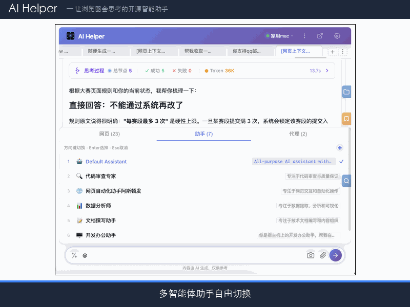

> [English](./README.md) | [中文](./README.zh-CN.md)

# AI Helper

### The open-source browser extension that lets LLMs actually operate web pages

Not just chat — it clicks, fills forms, drags, uploads files, runs terminal commands, and extends via MCP.

      

### [Install on Microsoft Edge →](https://microsoftedge.microsoft.com/addons/detail/ai-helper-%E7%BD%91%E9%A1%B5%E6%99%BA%E8%83%BD%E5%8A%A9%E6%89%8B/kabhmgfbkhpbfhhnokaafhkdbckeipcl)

Chrome / Chromium users: see the developer-mode load step in the [30-second quickstart](#30-second-quickstart) below.

---

One sentence to make AI read pages, fill forms, upload files, and run commands.

---

## Demo Videos

**AI Helper product introduction** (~4 min · narrated): complete walkthrough of the ReAct reasoning loop, 40+ built-in tools, multi-agent collaboration, workspace management, Skill system and MCP protocol — see how the browser assistant thinks and acts.

<video src="docs/videos/ai-helper-intro-video-en.mp4" controls preload="metadata" width="100%"></video>

- ▶️ English: [Watch online](https://xiweicheng.github.io/ai-helper/videos/ai-helper-intro-video-en.mp4) · in-repo [`docs/videos/ai-helper-intro-video-en.mp4`](docs/videos/ai-helper-intro-video-en.mp4)
- ▶️ 中文版：[在线观看](https://xiweicheng.github.io/ai-helper/videos/ai-helper-intro-video-zh.mp4) · in-repo [`docs/videos/ai-helper-intro-video-zh.mp4`](docs/videos/ai-helper-intro-video-zh.mp4)

**AI plugin fills batch forms automatically** (67s · narrated & subtitled): attach an Excel sheet and order in one sentence — the plugin opens the form page, reads rows one by one, fills every field and submits, ending with a split-screen check against the source data.

<video src="docs/videos/form-autofill-demo-en.mp4" poster="docs/videos/cover-en.jpg" controls preload="metadata" width="100%"></video>

- ▶️ English: [Watch online](https://xiweicheng.github.io/ai-helper/videos/form-autofill-demo-en.mp4) · in-repo [`docs/videos/form-autofill-demo-en.mp4`](docs/videos/form-autofill-demo-en.mp4)
- ▶️ 中文版：[在线观看](https://xiweicheng.github.io/ai-helper/videos/form-autofill-demo-zh.mp4) · in-repo [`docs/videos/form-autofill-demo-zh.mp4`](docs/videos/form-autofill-demo-zh.mp4)

## What it can do for you

- **Fill a complex form and upload attachments with one sentence** — AI locates the fields, types the values, and submits. Shadow DOM and React controlled components included.
- **Summarize any open tab (Bilibili / YouTube / PDF / long article) and export to Word or PDF** — type `@`, pick the tab, ask for a summary, click export.
- **Watch a page on a schedule** — Cron / interval / one-off tasks re-run your prompt against a bound URL and write results into a chosen session.
- **Let AI touch your local files and terminal** — optional Agent service, with three-tier command safety and a 7-day trash bin as a safety net.

## How it compares

| Capability | Closed-source commercial AI extension | Browser-automation code framework | Chat-only sidebar | **AI Helper** |
|---|---|---|---|---|
| Open source | No | Yes | Partial | **Yes (MIT)** |
| Setup cost | Install + subscribe | Write Python / JS | Install | **Install and go** |
| Actually clicks / fills / uploads | Partial | Yes | No | **Yes** |
| Local file read-write + terminal commands | No | DIY | No | **Yes (optional Agent)** |
| MCP protocol extension | Few | DIY | No | **Yes** |
| Multi-agent collaboration / sub-task dispatch | No | DIY | No | **Yes** |
| Tool preselection + token-budget savings | No | DIY | No | **Yes** |
| Three-tier reflection quality assurance | No | DIY | No | **Yes** |
| Scheduled tasks + checkpoint resume | Few | DIY | No | **Yes** |
| Data stays local / under your control | No | Yes | Partial | **Yes** |

## Why not just use another AI sidebar?

- **Three-tier reflection quality assurance.** Preselection → tool-level reflection → sub-task reflection → post-reflection. Every final answer is scored on 7 dimensions; below-threshold runs get revised or re-executed automatically.
- **Tool preselection saves tokens.** 40+ tool definitions would blow up every call. A lightweight API pre-pass narrows them down to the 5–10 that actually matter before the main model runs.
- **Token-budget management.** Truncation is by token count, not message count, so `tool_calls` / `tool` message pairs never get split apart.
- **Long-quote auto-compression.** Big page selections are summarized instead of squatting in your context forever.
- **Checkpoint resume + Service Worker restart recovery.** Long tasks survive SW silent restarts and can be resumed with one click after any interruption.
- **Scheduled tasks + long-term memory + file trash bin + audit logs.** The unglamorous pieces that turn an AI chat toy into something you can actually rely on day after day.

## Three starter scenarios

**A. Auto-fill a complex form + upload a file.** Attach the file, tell the AI what to fill, watch it locate the fields, type values, and submit — Shadow DOM and React controlled components included. [Details →](docs/en/DOCUMENTATION.md#22-shadow-dom-deep-penetration)

**B. Summarize the current tab and export.** Type `@`, pick the active tab, ask for a summary, then export to Word / PDF / image / JSON from the message action bar. [Details →](docs/en/DOCUMENTATION.md#14-message-operations)

**C. Scheduled page-watch.** Every day at 9am, re-run a prompt against a bound URL and drop the result into a chosen session. Cron / interval / one-off all supported, with run history and failure notifications. [Details →](docs/en/DOCUMENTATION.md#30-scheduled-tasks)

## 30-second quickstart

1. **Install** — one click from the [Microsoft Edge Add-ons store](https://microsoftedge.microsoft.com/addons/detail/ai-helper-%E7%BD%91%E9%A1%B5%E6%99%BA%E8%83%BD%E5%8A%A9%E6%89%8B/kabhmgfbkhpbfhhnokaafhkdbckeipcl), or run `npm install && npm run build` and load the `dist/` folder from `chrome://extensions/` in developer mode.
2. **Open the side panel** — press `Ctrl+Shift+Y` / `Cmd+Shift+Y`, or click the extension icon.
3. **Add your API key** — Options → Basic Settings. Any OpenAI-compatible endpoint works; DeepSeek presets ship by default.
4. **(Optional) Unlock local files, terminal commands, MCP, and Skills** — run `npm install -g ai-helper-agent && aha start -b`, then paste the 6-digit pairing code into Options → Agent.

Requires Chrome / Edge / Chromium 114+ (Side Panel API).

## Full documentation

Everything below the quickstart lives in the full technical reference:

- **English** — architecture, all 30 features, 40+ tools, Agent service, configuration, state management, FAQ → [`docs/en/DOCUMENTATION.md`](docs/en/DOCUMENTATION.md)
- **中文** — 架构总览、30 项功能、40+ 工具、代理服务、配置说明、状态管理、常见问题 → [`docs/zh/DOCUMENTATION.md`](docs/zh/DOCUMENTATION.md)
- **Website** — <https://xiweicheng.github.io/ai-helper/>
- **Product write-up (中文)** — [`docs/AI-Helper-作品介绍文档.md`](docs/AI-Helper-作品介绍文档.md)

## Community & contributing

- **Discord** — <https://discord.gg/VPcqMBFGa>
- **Issues** — <https://github.com/xiweicheng/ai-helper/issues> · [`good first issue`](https://github.com/xiweicheng/ai-helper/labels/good%20first%20issue)
- Every issue gets a reply within 24 hours.
- PRs welcome — read the [Architecture Overview](docs/en/DOCUMENTATION.md#architecture-overview) before you start.

## License

MIT License · Copyright (c) 2026 AI Helper
