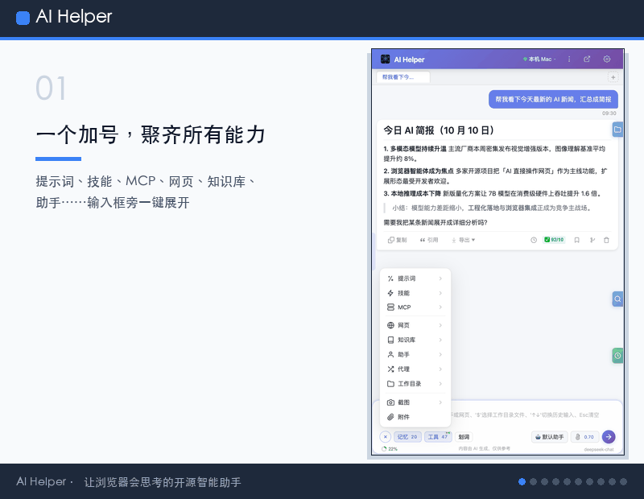

> [English](./README.md) | [中文](./README.zh-CN.md)

# AI Helper — 网页智能助手

### 让大模型亲手操作网页的开源浏览器插件

不只是聊天 —— 真的会点击、填表、拖拽、上传文件、跑终端命令，还能通过 MCP 动态扩展工具。

      

### [安装到 Microsoft Edge →](https://microsoftedge.microsoft.com/addons/detail/ai-helper-%E7%BD%91%E9%A1%B5%E6%99%BA%E8%83%BD%E5%8A%A9%E6%89%8B/kabhmgfbkhpbfhhnokaafhkdbckeipcl)

Chrome / Chromium 用户请看下方 [30 秒上手](#30-秒上手) 里的开发者模式加载方式。

---

一句话让 AI 帮你读网页、填表单、传文件、跑命令。

---

## 演示视频

**AI Helper 产品介绍**（约 4 分钟 · 带旁白）：完整讲解 ReAct 推理循环、40+ 内置工具、多智能体协作、工作目录管理、Skill 系统与 MCP 协议扩展——一次看懂浏览器助手如何思考与执行。

<video src="docs/videos/ai-helper-intro-video-zh.mp4" controls preload="metadata" width="100%"></video>

- ▶️ 中文版：[在线观看](https://xiweicheng.github.io/ai-helper/videos/ai-helper-intro-video-zh.mp4) · 仓库内 [`docs/videos/ai-helper-intro-video-zh.mp4`](docs/videos/ai-helper-intro-video-zh.mp4)
- ▶️ English：[Watch online](https://xiweicheng.github.io/ai-helper/videos/ai-helper-intro-video-en.mp4) · 仓库内 [`docs/videos/ai-helper-intro-video-en.mp4`](docs/videos/ai-helper-intro-video-en.mp4)

**AI 插件自动批量录入表单**（67 秒 · 带旁白与字幕）：附 Excel 数据源一句话下单，插件自动跳转表单页、逐行读取、自动填入并提交，结尾与源数据分屏核对。

<video src="docs/videos/form-autofill-demo-zh.mp4" poster="docs/videos/cover-zh.jpg" controls preload="metadata" width="100%"></video>

- ▶️ 中文版：[在线观看](https://xiweicheng.github.io/ai-helper/videos/form-autofill-demo-zh.mp4) · 仓库内 [`docs/videos/form-autofill-demo-zh.mp4`](docs/videos/form-autofill-demo-zh.mp4)
- ▶️ 英文版：[Watch online](https://xiweicheng.github.io/ai-helper/videos/form-autofill-demo-en.mp4) · 仓库内 [`docs/videos/form-autofill-demo-en.mp4`](docs/videos/form-autofill-demo-en.mp4)

## 它能帮你做什么

- **一句话让它自动填复杂表单 + 上传附件** —— AI 自己找字段、输内容、点提交，Shadow DOM 和 React 受控组件都能穿透。
- **一键总结当前 Tab（B 站 / YouTube / PDF / 长文），导出为 Word 或 PDF** —— 输入 `@` 选中当前页，出结果，点导出。
- **定时盯一个网页** —— Cron / 间隔 / 一次性三种调度，按时重跑你的指令，把结果写入指定会话。
- **让 AI 直接读写你本地文件、跑终端命令** —— 可选本地 Agent，命令三级安全 + 7 天回收站兜底。
- **用自己的文档建知识库问答** —— PDF / Word / Excel / PPT / Markdown / HTML / CSV 一键导入本地知识库，检索增强回答附带可点击的引用来源，还支持多库同时检索。
- **任意厂商，两下切换** —— 保存多套 OpenAI 兼容厂商配置（地址 / Key / 模型列表），在侧边栏先选厂商、再选模型，随切随用。
- **任务完成不错过** —— 任务完成 / 失败、定时任务结束、AI 等待确认或澄清时弹出桌面通知，点击即可回到侧边栏。

## 能力对比

| 维度 | 商业闭源浏览器 AI 插件 | 浏览器自动化代码框架 | 纯聊天侧边栏 | **AI Helper** |
|---|---|---|---|---|
| 是否开源 | 否 | 是 | 部分 | **是（MIT）** |
| 上手门槛 | 装插件 + 订阅 | 写 Python / JS | 装插件 | **装插件即用** |
| 真的点击 / 填表 / 上传文件 | 部分 | 是 | 否 | **是** |
| 本地文件读写 + 终端命令 | 否 | 需自建 | 否 | **是（可选 Agent）** |
| MCP 协议动态扩展 | 少数 | 需自建 | 否 | **是** |
| 内置本地知识库（RAG）+ 引用溯源 | 部分 | 需自建 | 否 | **是（可选 Agent）** |
| 多 Agent 协作 / 子任务分派 | 否 | 需自建 | 否 | **是** |
| 工具预选 + Token 预算省钱 | 否 | 需自建 | 否 | **是** |
| 三级反思质量保障 | 否 | 需自建 | 否 | **是** |
| 定时任务 + 断点续接 | 少数 | 需自建 | 否 | **是** |
| 数据本地 / 自主可控 | 否 | 是 | 部分 | **是** |

## 为什么不只是"另一个 AI 侧边栏"

- **三级反思质量保障**：预筛选 → 工具级反思 → 子任务反思 → 后置反思。每轮最终答案都会做 7 维度评分，未达标自动修订或重跑，不会把 LLM 原始输出直接甩给你。
- **工具预选省钱**：40+ 个工具定义全塞给主力模型 Token 会爆炸，先用一次轻量 API 缩到 5–10 个真正相关的，再喂给主模型。
- **Token 预算管理**：按 Token 数而非消息数截断，`tool_calls` / `tool` 消息配对永远不会被腰斩。
- **长引用自动压缩**：选中一大段网页也不会永远霸占上下文，自动摘要压缩，把空间留给真正相关的信息。
- **内置本地知识库（RAG）**：导入自有文档，向量 + 关键词混合检索，回答附引用来源；索引存在本机，文件不出本地。
- **Checkpoint 断点续接 + SW 重启恢复**：长任务能扛住 Service Worker 静默重启，被中断后一键继续。
- **定时任务 + 长期记忆 + 文件回收站 + 审计日志**：这些"不出彩"的东西，才是把 AI 从聊天玩具变成能长期跑的生产力的关键。

## 典型场景

**场景 A：自动填复杂表单 + 上传文件。** 附上文件，告诉 AI 要填什么，看它自己找字段、输内容、点提交 —— Shadow DOM 和 React 受控组件都能穿透。[详细 →](docs/zh/DOCUMENTATION.md#22-shadow-dom-深度穿透)

**场景 B：一键总结当前 Tab 并导出。** 输入 `@` 选中当前标签页，让 AI 总结，然后从消息操作栏一键导出 Word / PDF / 图片 / JSON。[详细 →](docs/zh/DOCUMENTATION.md#14-消息操作)

**场景 C：定时任务盯网页。** 每天 9 点针对指定 URL 重跑一段指令，结果落到你选定的会话里。支持 Cron / 间隔 / 一次性三种调度，带运行历史和失败通知。[详细 →](docs/zh/DOCUMENTATION.md#30-定时任务)

**场景 D：向自己的知识库提问。** 启动 Agent 后，在选项页「知识库」创建知识库并导入文档，回到侧边栏直接提问 —— 回答会带着引用气泡，指向命中的原文片段。[技术细节 →](agent/README.zh-CN.md#知识库rag)

## 30 秒上手

1. **安装** —— [Microsoft Edge 扩展商店](https://microsoftedge.microsoft.com/addons/detail/ai-helper-%E7%BD%91%E9%A1%B5%E6%99%BA%E8%83%BD%E5%8A%A9%E6%89%8B/kabhmgfbkhpbfhhnokaafhkdbckeipcl) 一键装；或从 [GitHub Releases](https://github.com/xiweicheng/ai-helper/releases/latest) 下载自动构建的扩展包（`ai-helper-*.zip`），解压后在 `chrome://extensions/` 开启开发者模式，点击「加载已解压的扩展程序」选择解压后的文件夹。开发者可从源码构建：`npm install && npm run build` 后加载 `dist/` 目录。
2. **打开侧边栏** —— 按 `Ctrl+Shift+Y` / `Cmd+Shift+Y`，或点击扩展图标。
3. **填入 API Key** —— 选项页 → 基础设置。任何 OpenAI 兼容端点都行，默认预置 DeepSeek；可保存多套厂商配置随时切换。
4. **（可选）解锁本地文件 / 命令 / MCP / Skill / 知识库** —— 执行 `npm install -g ai-helper-agent && aha start -b`，把终端里的 6 位配对码填到选项页 → Agent。

需要 Chrome / Edge / Chromium 114+ 版本（Side Panel API）。

## 完整文档

上手之后的所有细节都放在完整技术参考里：

- **中文** —— 架构总览、31 项功能、40+ 工具、代理服务、配置说明、状态管理、常见问题 → [`docs/zh/DOCUMENTATION.md`](docs/zh/DOCUMENTATION.md)
- **English** —— architecture、31 features、40+ tools、Agent service、configuration、state management、FAQ → [`docs/en/DOCUMENTATION.md`](docs/en/DOCUMENTATION.md)
- **Wiki** —— 安装、功能、工具、代理、配置全站 → [中文](https://github.com/xiweicheng/ai-helper/wiki) · [English](https://github.com/xiweicheng/ai-helper/wiki/Home-EN)
- **文档站** —— <https://xiweicheng.github.io/ai-helper/>
- **作品介绍** —— [`docs/AI-Helper-作品介绍文档.md`](docs/AI-Helper-作品介绍文档.md)

## 社区与贡献

- **GitHub 讨论组** —— <https://github.com/xiweicheng/ai-helper/discussions>
- **Issues** —— <https://github.com/xiweicheng/ai-helper/issues> · [`good first issue`](https://github.com/xiweicheng/ai-helper/labels/good%20first%20issue)
- 每个 Issue 24 小时内回复。
- 欢迎 PR —— 动手前建议先看 [架构总览](docs/zh/DOCUMENTATION.md#架构总览)。

## 赞助与合作伙伴

感谢以下赞助方以 Token 额度、算力、云资源或服务等方式支持本项目。作为回馈，项目通过 README、文档站等渠道为赞助方提供持续曝光与引流，欢迎更多互利合作。

| 赞助方 | 支持内容 | 链接 |
|---|---|---|
| **硅碳相变 Token工厂**（SiCore TokenWorks）· 北京硅碳相变智能技术有限公司 OpenAI 兼容的 AI 大模型 API 聚合平台，一个密钥调用盘古 / DeepSeek / 通义千问 / 文心一言 / 豆包 / GPT / Claude / Gemini 等主流模型 | 大模型 Token 额度赞助 | <https://www.token8341.com> |

有意赞助或合作？欢迎通过 [GitHub 讨论组](https://github.com/xiweicheng/ai-helper/discussions) 或 [Issues](https://github.com/xiweicheng/ai-helper/issues) 与我们联系。

## License

MIT License · Copyright (c) 2026 AI Helper
