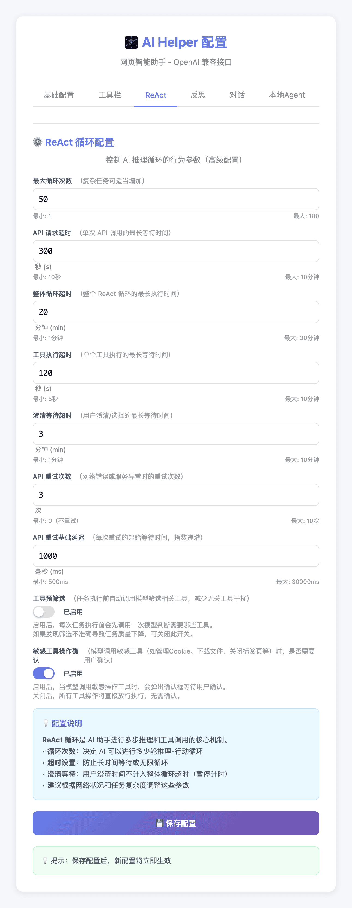
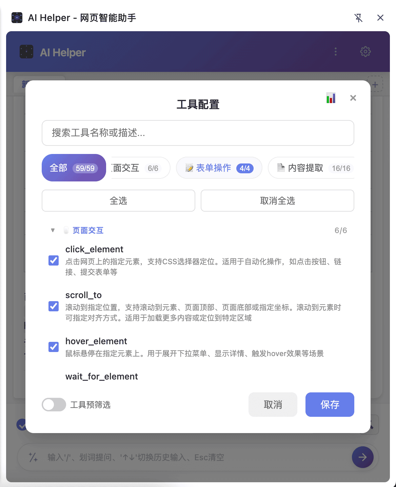
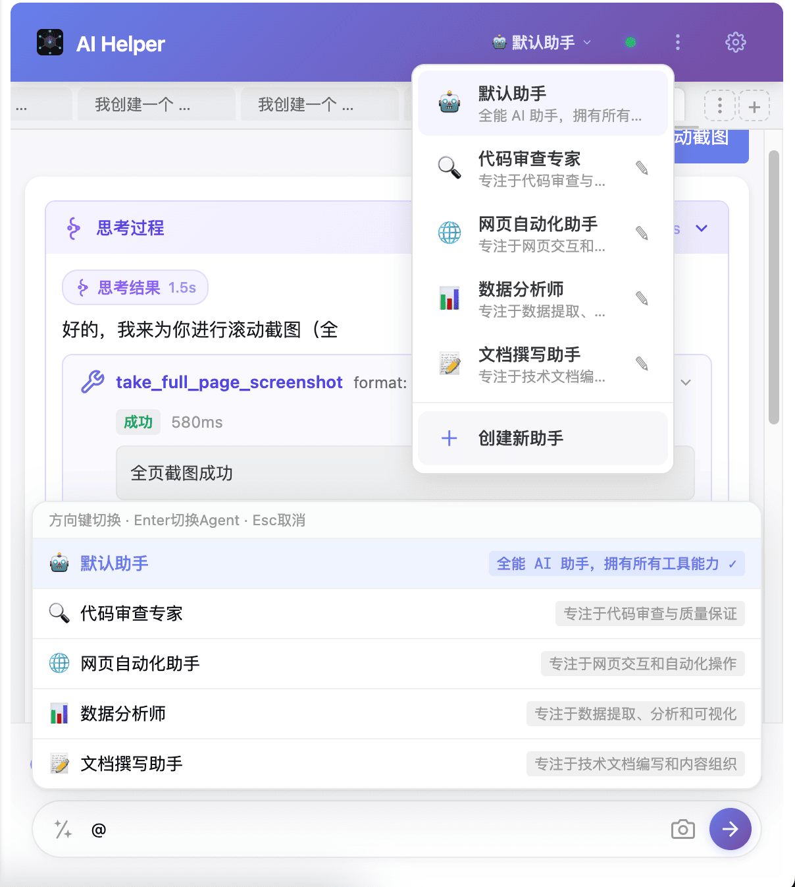
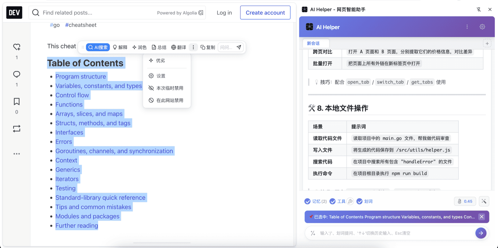
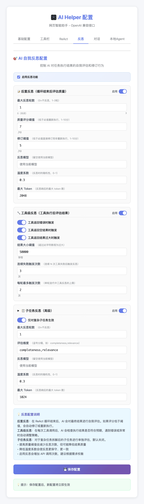
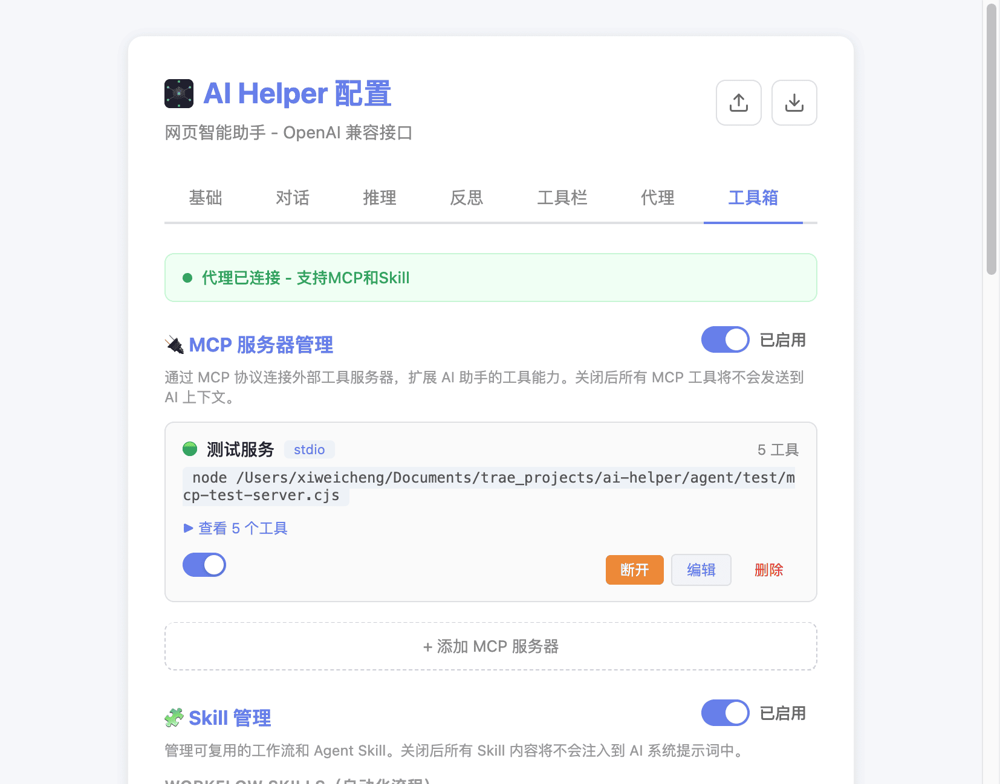
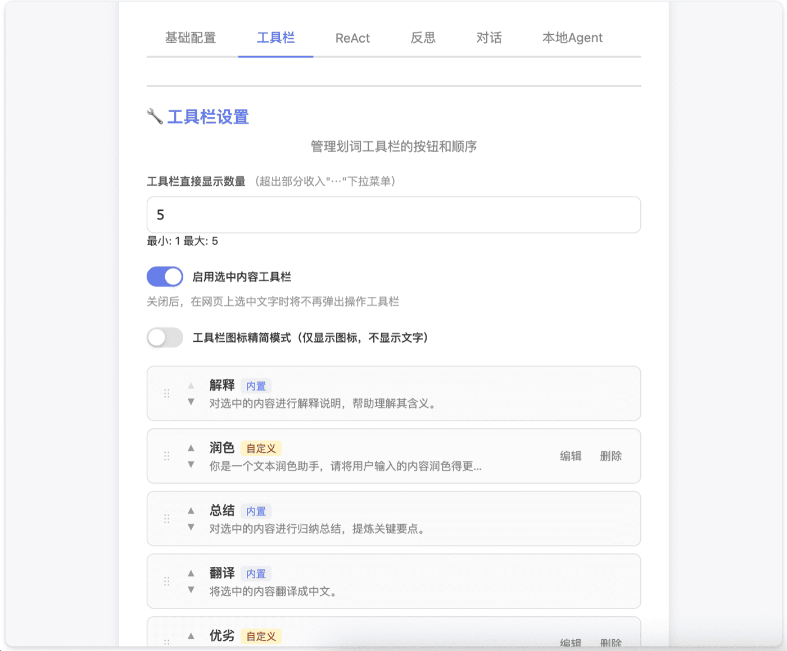
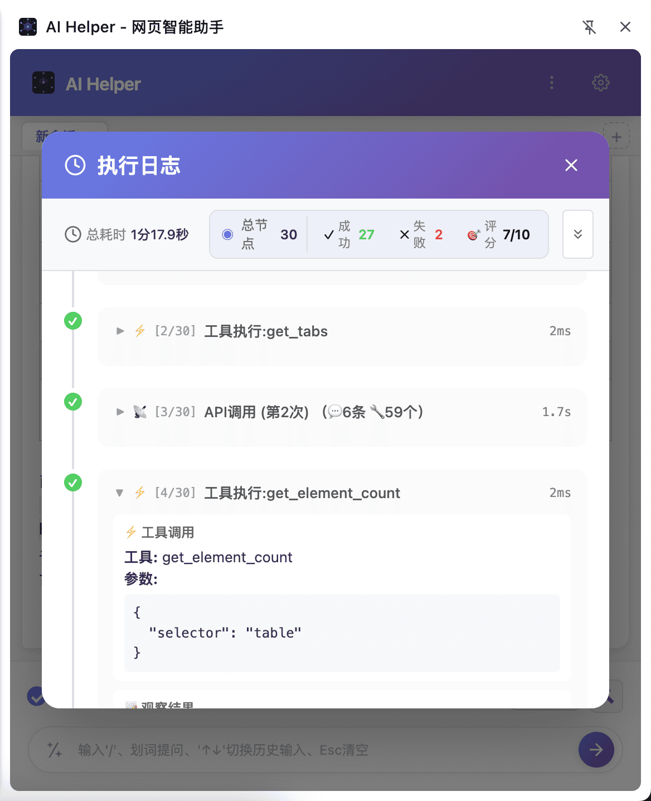

## 初赛稿

### 【标签】学习工作

### 【标题】【学习工作赛道】AI Helper - 让浏览器会思考的智能助手

---

### 0. 先和大家打个招呼吧 👋

**你是谁：**  
一名独立开发者，专注于AI工具和浏览器扩展开发。

**你是怎么用 TRAE 把 Demo 做出来的：**  
在开发 AI Helper 的过程中，TRAE 成为了我最得力的"编程搭档"。刚开始我只是有一个模糊的想法——想要一个能真正操作浏览器的AI助手，但不知道从哪里下手。

我试着把想法一句句讲给 TRAE 听："我想要一个Chrome扩展，能和AI对话，还能帮我点击网页上的按钮"、"我需要实现ReAct推理循环，让AI能自己决定调用什么工具"、"帮我写一个文件上传的功能，支持PDF、Word和Excel"。

最让我惊喜的是**多智能体系统**的实现。原本我以为需要设计复杂的架构，但 TRAE 帮我规划了清晰的方案：每个Agent有独立的系统提示词和工具权限，通过`dispatch_sub_agent`工具实现子任务分派。整个流程一气呵成，让我觉得"原来这么简单"！

TRAE 还帮我跨过了一个原本以为搞不定的坎——**MCP协议扩展**。我对JSON-RPC 2.0和stdio传输不太熟悉，但 TRAE 一步步帮我实现了MCP Client、多Server管理和工具动态注入功能，让整个系统具备了无限扩展的能力。

---

### 1. Demo 简介

**是什么：**  
一个基于大语言模型的 Chrome 浏览器智能助手扩展（Manifest V3），采用 ReAct 推理循环架构，支持自然语言对话、浏览器自动化操作、网页内容处理等 50+ 项内建工具 + MCP 动态扩展。

**面向谁：**  
核心用户是**开发者、知识工作者、数据分析师**——所有需要在浏览器中高效完成工作的人。

**主要功能：**

1. **ReAct 推理循环**：AI 自主思考并调用工具完成任务，无需人工干预

   

2. **62 个内置工具**：覆盖内容提取、页面交互、标签页管理、媒体输出等，浏览器即操作系统

   

3. **多智能体协作**：内置5个专业助手模板（代码审查专家、网页自动化助手、数据分析师等），支持自定义Agent和子任务并行分派

   

4. **划词即用浮动工具栏**：在任意网页选中文本，一键触发AI搜索、解释、翻译、总结

   

5. **三级反思系统**：工具级反思 → 子任务反思 → 后置反思（7维度质量评分），确保输出质量

   

---

### 2. Demo 创作思路

**灵感来源：**  
每天我都在浏览器里阅读文档、处理数据、写代码，但现有的AI工具要么是独立的网页应用，要么只能被动地回答问题——它们无法真正"理解"我正在看的网页内容，更无法替我操作浏览器。我想要一个能"活"在浏览器里的AI助手。

**想解决的问题：**  
用户真实存在的痛点：
- 网页上的数据需要手动复制粘贴到Excel，耗时且易出错
- 填写大量表单时需要反复切换页面，效率低下
- 阅读长文档时需要人工总结，信息获取成本高
- 现有AI工具与浏览器能力割裂，无法联动

**为什么做这个方向：**  
我的判断和取舍：
1. **浏览器是最佳入口**：用户每天花费最多时间的应用就是浏览器，将AI能力集成到浏览器中最符合用户习惯
2. **ReAct是正确的架构**：传统的问答式AI无法完成复杂任务，ReAct让AI学会"思考-行动"循环
3. **工具扩展是核心竞争力**：内置工具解决80%的场景，MCP协议扩展覆盖剩余20%的个性化需求
4. **质量保障不可少**：AI不是完美的，三级反思系统确保输出可靠

---

### 3. Demo 体验地址

**部署随时可公开访问的体验链接：**  
GitHub 项目地址：待补充（请将实际仓库链接填写在此处）

**安装方式：**
1. 克隆项目：`git clone <实际仓库地址>`
2. 构建：`npm install && npm run build`
3. Chrome 打开 `chrome://extensions/`，开启开发者模式
4. 点击"加载已解压的扩展程序"，选择 `dist` 文件夹
5. 在选项页配置API Key，即可开始使用

---

### 4. TRAE 实践过程

**完整开发流程：**

1. **需求分析与架构设计**：与TRAE讨论产品定位、核心功能和技术架构，确定五层架构（Side Panel → Background → Content Script → Agent → Storage）

2. **核心引擎开发**：实现 ReAct 推理循环、工具预筛选、Token预算管理、上下文压缩等核心逻辑

3. **工具系统构建**：开发9大类62个内置工具，实现工具注册、执行调度、安全确认机制

4. **UI界面开发**：构建Side Panel对话面板、多会话管理、执行日志、Token统计面板等

5. **代理服务开发**：实现Node.js本地代理，支持文件系统、命令执行、Skill系统、MCP协议

6. **质量保障系统**：开发三级反思系统，实现工具级反思、子任务反思、后置反思（7维度评分）

7. **持续优化迭代**：修复bug、优化性能、完善用户体验

**关键步骤截图：**

1. **ReAct推理循环配置**  
   

2. **多智能体助手管理**  
   

3. **MCP和Skill工具箱配置**  
   

4. **划词工具栏自定义配置**  
   

5. **循环推理执行日志追踪**  
   

**关键任务对话的 Session ID：**

| Session ID | 任务描述 |
|------------|----------|
| `6a54ec5383a964f9efddbdf9` | MCP协议配置UI优化、双超时机制实现、引用内容重复渲染修复、estimateTokens未定义错误修复 |
| `6a4f8c9b9bb65a13e3cc3c33` | ReAct思考输出分割问题修复、工具并行执行机制分析与优化 |
| `6a4fa5349bb65a13e3cc4050` | 删除消息刷新后重新出现问题修复、消息ID生成与持久化逻辑优化 |
| `6a4bbe5aab99a2c75dae422c` | chat-manager.js模块化拆分、路由表注释添加、项目规则优化 |
| `6a3fce22d1e9fc00d16146a4` | Agent日志系统实现（JSON Lines格式、日志轮转、API查询）、工具配置保存同步修复 |

**踩坑复盘：**

开发过程中遇到了几个印象深刻的技术难题，都是在TRAE的帮助下解决的：

1. **消息删除后刷新重现**（Session ID: `6a4fa5349bb65a13e3cc4050`）
   - 问题：删除消息后页面刷新，消息又重新出现
   - 原因：旧消息从存储加载时缺少messageId，导致删除时无法正确匹配
   - 解决：TRAE帮我分析了IndexedDB存储逻辑，修改了`loadChatHistory()`函数，为旧条目自动生成messageId并写回state

2. **ReAct思考输出分割重叠**（Session ID: `6a4f8c9b9bb65a13e3cc3c33`）
   - 问题：单个思考输出被分割成多个条目，内容重叠
   - 原因：`updateStreamingMessage()`函数没有检查上一个thinking-content是否已完成
   - 解决：TRAE帮我定位了chat-manager.js中的逻辑漏洞，添加了思考完成判断

3. **代码模块化后的引用错误**（Session ID: `6a4bbe5aab99a2c75dae422c`）
   - 问题：拆分chat-manager.js后，`buildUserContent`函数提示未定义
   - 原因：使用`export { ... } from`语法不会创建内部函数绑定
   - 解决：TRAE帮我理解了ES Module的导出机制，改为先导入到本地作用域再重新导出

4. **estimateTokens未定义错误**（Session ID: `6a54ec5383a964f9efddbdf9`）
   - 问题：发送消息时`estimateTokens is not defined`
   - 原因：chat-manager.js的import语句遗漏了estimateTokens
   - 解决：TRAE快速定位并修复了导入语句

---

### 5. 对应的报名审核通过的帖子链接

（请在此处填写报名审核通过的帖子链接）