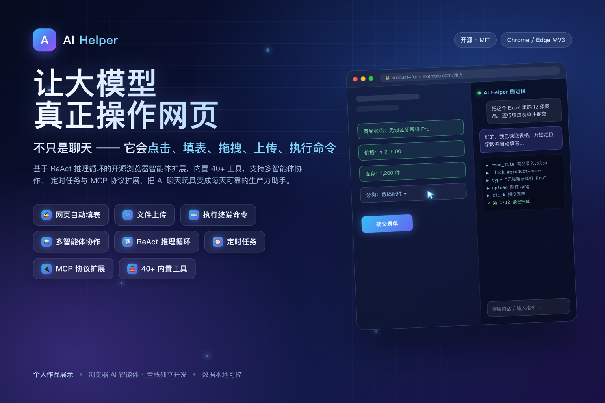

<div align="center">

# AI Helper
### 让大模型真正操作网页的开源浏览器智能体

不只是聊天 —— 它会**点击、填表、拖拽、上传、执行命令**。



</div>

| 项目 | 内容 |
|:---|:---|
| **作品类型** | 开源浏览器扩展（Chrome / Edge，Manifest V3）+ 本地 Agent 服务 |
| **个人角色** | 独立全栈开发（架构设计 / 前后端 / Agent 服务 / 文档与测试） |
| **核心技术** | ReAct 推理循环 · 多智能体协作 · MCP 协议 · Content Script 页面操控 |
| **开源协议** | MIT License |

---

## 一、我解决了什么问题

主流 AI 对话工具与浏览器是**割裂**的：它看不到你正在浏览的页面，更无法替你操作。数据要手动搬运、表单要逐页填写、长文要人工总结。

AI Helper 把浏览器变成 AI 的**操作系统**：LLM 通过 40+ 内建工具与 MCP 动态扩展工具，像人一样理解并操作网页，同时借助本地 Agent 获得文件读写与命令执行能力。

---

## 二、核心能力亮点

**1. 真正的网页操控，而非只读**
点击、填表、拖拽、滚动、上传文件；Shadow DOM 递归穿透，可操作 React / Vue / Web Components 与富文本编辑器等传统自动化工具难以触及的组件。

**2. ReAct 推理引擎 + 三级反思质量保障**
思考 → 调用工具 → 反馈 → 再推理的闭环；工具级 / 子任务 / 后置三级反思，对最终答案做 **7 维度评分**（完整性、准确性、相关性、工具使用、清晰度、安全性、效率），不合格自动修订或重试，而非直接返回 LLM 原始输出。

**3. Token 成本与长对话质量优化**
调用主力模型前用轻量 API **预筛选工具**（40+ 缩减为 5–10 个）；按 Token 数做预算管理、三级上下文压力监测与增量摘要压缩，长对话质量不下滑、成本可控。

**4. 多智能体协作与任务拆解**
内置 5 种专业助手模板 + 自定义 Agent；复杂任务可拆解为子任务，按顺序 / 并行 / 条件策略分派给不同 Agent 并行执行。

**5. MCP 协议无限扩展 + Skill 沉淀**
支持同时接入多个 MCP Server，工具即插即用；Skill 系统从对话中沉淀可复用技能。

**6. 浏览器原生多格式处理与本地文件能力**
浏览器端直接解析 PDF / Word / Excel 等 **50+ 格式**，无需服务器、保护隐私；连接 Agent 后可管理本地文件、执行终端命令（黑/灰/白名单三级安全 + 文件回收站兜底）。

---

## 三、技术架构（五层）

```
UI 层        Side Panel：对话 / 多会话 / 执行日志 / 工作目录 / 划词工具栏
核心逻辑层    Background Service Worker：ReAct 循环 / 三级反思 / 工具调度 / 预筛选
页面执行层    Content Script：内容提取 / 页面交互 / Shadow DOM 穿透
代理服务层    Node.js Agent：文件沙箱 / 命令三级安全 / Skill / MCP / 回收站
持久化层      IndexedDB + chrome.storage（local / session 跨重启恢复）
```

---

## 四、技术栈

Chrome MV3 · Service Worker · Side Panel API · Content Script · Vite · IndexedDB · OpenAI-Compatible API（含 Vision / 流式）· Node.js + WebSocket（Agent）· MCP Protocol · marked / mermaid / pdf.js / mammoth / SheetJS · Vitest + Playwright

---

## 五、工程与质量

- **安全**：敏感操作二次确认、命令三级安全、路径沙箱、配对认证、文件回收站、审计日志。
- **可靠**：Checkpoint 断点续接 + Service Worker 重启自动恢复，长任务中断可一键继续。
- **质量**：ESLint 规范、模块化设计、Vitest 单元测试 + Playwright E2E、中英文国际化。
- **开源**：MIT 协议完全开源，结构清晰、注释完善，欢迎社区贡献。

---

## 六、成果速览

| 40+ | 50+ | 7 | 3 | MIT |
|:---:|:---:|:---:|:---:|:---:|
| 内建工具（11 大类） | 可解析文件格式 | 维度答案质量评分 | 级反思质量保障 | 完全开源 |

---

## 七、了解更多

- **在线网站**：<https://xiweicheng.github.io/ai-helper/>
- **开源仓库**：<https://github.com/xiweicheng/ai-helper>
- **Edge 商店**：已上架 Microsoft Edge Add-ons
- **演示视频**：产品介绍（约 4 分钟）/ 自动填表 Demo（67 秒），见仓库 `docs/videos/`
